# 一括登録機能 フロー図

**バージョン:** 1.0  
**最終更新日:** 2024年12月  
**作成者:** 開発チーム

---

## 📋 目次

1. [概要](#概要)
2. [全体フロー](#全体フロー)
3. [詳細フロー](#詳細フロー)
4. [シーケンス図](#シーケンス図)
5. [状態遷移図](#状態遷移図)
6. [エラーハンドリングフロー](#エラーハンドリングフロー)
7. [データ変換フロー](#データ変換フロー)

---

## 概要

一括登録機能には以下の2つの形式があります：

1. **CSV形式**: セクションマーカーを使った従来形式
2. **Excel形式**: 5シート構成の新形式（本ドキュメントの主眼）

---

## 全体フロー

### ユーザージャーニー

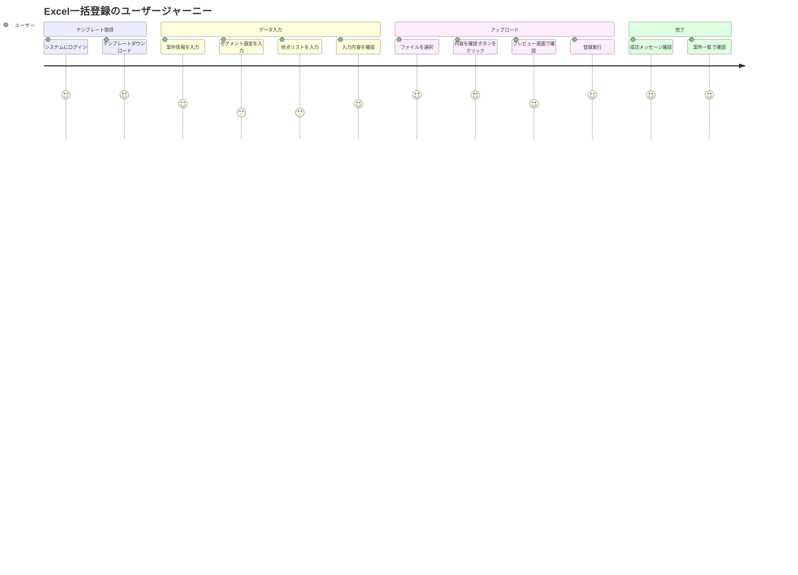
```mermaid
journey
    title Excel一括登録のユーザージャーニー
    section テンプレート取得
      システムにログイン: 5: ユーザー
      テンプレートダウンロード: 5: ユーザー
    section データ入力
      案件情報を入力: 4: ユーザー
      セグメント設定を入力: 3: ユーザー
      地点リストを入力: 3: ユーザー
      入力内容を確認: 4: ユーザー
    section アップロード
      ファイルを選択: 5: ユーザー
      内容を確認ボタンをクリック: 5: ユーザー
      プレビュー画面で確認: 4: ユーザー
      登録実行: 5: ユーザー
    section 完了
      成功メッセージ確認: 5: ユーザー
      案件一覧で確認: 5: ユーザー
```

### ビジネスフロー

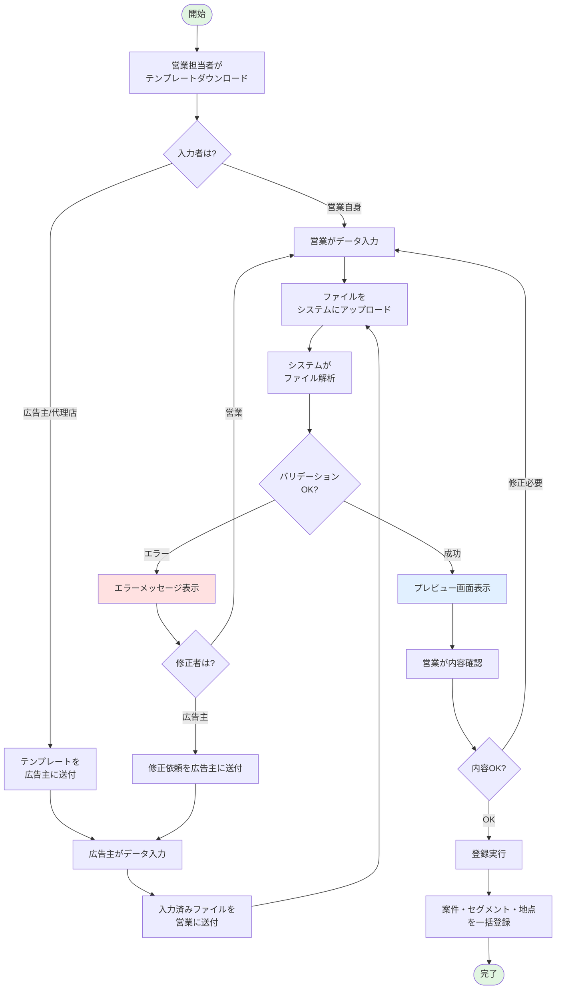
```mermaid
graph TB
    Start([開始]) --> A[営業担当者が<br/>テンプレートダウンロード]
    
    A --> B{入力者は?}
    
    B -->|営業自身| C[営業がデータ入力]
    B -->|広告主/代理店| D[テンプレートを<br/>広告主に送付]
    
    D --> E[広告主がデータ入力]
    E --> F[入力済みファイルを<br/>営業に送付]
    
    C --> G[ファイルを<br/>システムにアップロード]
    F --> G
    
    G --> H[システムが<br/>ファイル解析]
    
    H --> I{バリデーション<br/>OK?}
    
    I -->|エラー| J[エラーメッセージ表示]
    J --> K{修正者は?}
    K -->|営業| C
    K -->|広告主| L[修正依頼を広告主に送付]
    L --> E
    
    I -->|成功| M[プレビュー画面表示]
    M --> N[営業が内容確認]
    
    N --> O{内容OK?}
    O -->|修正必要| C
    
    O -->|OK| P[登録実行]
    P --> Q[案件・セグメント・地点<br/>を一括登録]
    
    Q --> R([完了])
    
    style Start fill:#e1f5e1
    style R fill:#e1f5e1
    style J fill:#ffe1e1
    style M fill:#e1f0ff
```

---

## 詳細フロー

### 1. テンプレート生成フロー

```mermaid
flowchart TD
    Start([テンプレート<br/>ダウンロード開始]) --> CreateWB[Workbookオブジェクト作成]
    
    CreateWB --> Sheet1[シート1作成:<br/>入力ガイド]
    Sheet1 --> Sheet1Content[テキストコンテンツ挿入]
    Sheet1Content --> Sheet1Style[スタイル適用<br/>フォント/色/配置]
    
    Sheet1Style --> Sheet2[シート2作成:<br/>案件情報]
    Sheet2 --> Sheet2Header[ヘッダー行作成]
    Sheet2Header --> Sheet2Sample[サンプル行挿入]
    Sheet2Sample --> Sheet2Input[入力行追加]
    Sheet2Input --> Sheet2Style[スタイル適用<br/>必須項目を黄色背景]
    Sheet2Style --> Sheet2Validation[日付の入力規則設定]
    
    Sheet2Validation --> Sheet3[シート3作成:<br/>セグメント設定]
    Sheet3 --> Sheet3Header[ヘッダー行作成]
    Sheet3Header --> Sheet3Sample[サンプル行挿入<br/>2行]
    Sheet3Sample --> Sheet3Input[入力行追加]
    Sheet3Input --> Sheet3Style[スタイル適用<br/>必須項目を黄色背景<br/>プルダウン項目を青背景]
    
    Sheet3Style --> Sheet4[シート4作成:<br/>地点リスト]
    Sheet4 --> Sheet4Header[ヘッダー行作成]
    Sheet4Header --> Sheet4Sample[サンプル行挿入<br/>5行]
    Sheet4Sample --> Sheet4Input[入力行追加]
    Sheet4Input --> Sheet4Style[スタイル適用]
    
    Sheet4Style --> Sheet5[シート5作成:<br/>選択肢リスト]
    Sheet5 --> Sheet5Content[選択肢データ挿入<br/>配信先/範囲/期間/対象者/検知回数/滞在時間]
    Sheet5Content --> Sheet5Hide[シートを非表示に設定]
    Sheet5Hide --> Sheet5Protect[シートを保護]
    
    Sheet5Protect --> AddDropdowns[プルダウン設定追加]
    AddDropdowns --> Dropdown1[シート3 B列:<br/>配信先プルダウン]
    Dropdown1 --> Dropdown2[シート3 C列:<br/>配信範囲プルダウン]
    Dropdown2 --> Dropdown3[シート3 D列:<br/>配信期間プルダウン]
    Dropdown3 --> Dropdown4[シート3 E列:<br/>対象者プルダウン]
    Dropdown4 --> Dropdown5[シート3 F列:<br/>検知回数プルダウン]
    Dropdown5 --> Dropdown6[シート3 I列:<br/>滞在時間プルダウン]
    Dropdown6 --> Dropdown7[シート4 A列:<br/>セグメント名プルダウン<br/>動的参照: シート3 A列]
    
    Dropdown7 --> GenerateBinary[Excelファイルを<br/>バイナリ形式で生成]
    GenerateBinary --> CreateBlob[Blobオブジェクト作成]
    CreateBlob --> Download[ブラウザダウンロード実行]
    
    Download --> End([完了])
    
    style Start fill:#e1f5e1
    style End fill:#e1f5e1
```

### 2. ファイル読み込みフロー

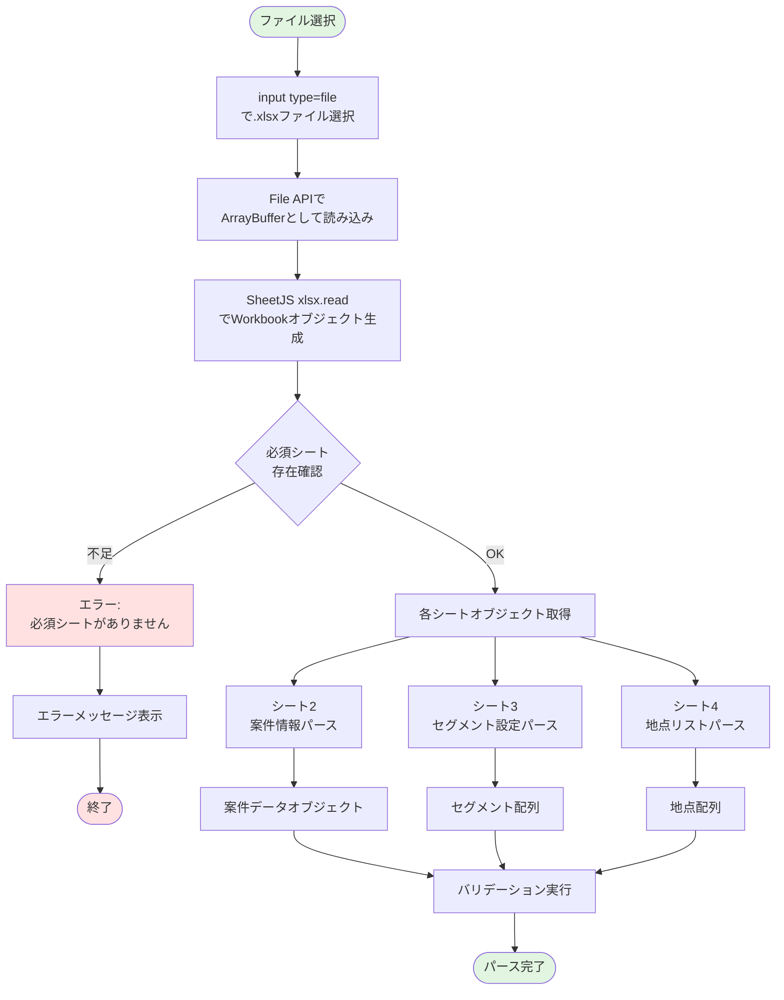
```mermaid
flowchart TD
    Start([ファイル選択]) --> FileInput[input type=file<br/>で.xlsxファイル選択]
    
    FileInput --> ReadFile[File APIで<br/>ArrayBufferとして読み込み]
    
    ReadFile --> ParseXLSX[SheetJS xlsx.read<br/>でWorkbookオブジェクト生成]
    
    ParseXLSX --> CheckSheets{必須シート<br/>存在確認}
    
    CheckSheets -->|不足| ErrorSheet[エラー:<br/>必須シートがありません]
    ErrorSheet --> ShowError[エラーメッセージ表示]
    ShowError --> End1([終了])
    
    CheckSheets -->|OK| GetSheets[各シートオブジェクト取得]
    
    GetSheets --> ParseProject[シート2<br/>案件情報パース]
    GetSheets --> ParseSegment[シート3<br/>セグメント設定パース]
    GetSheets --> ParseLocation[シート4<br/>地点リストパース]
    
    ParseProject --> ProjectData[案件データオブジェクト]
    ParseSegment --> SegmentData[セグメント配列]
    ParseLocation --> LocationData[地点配列]
    
    ProjectData --> Validate[バリデーション実行]
    SegmentData --> Validate
    LocationData --> Validate
    
    Validate --> End2([パース完了])
    
    style Start fill:#e1f5e1
    style End1 fill:#ffe1e1
    style End2 fill:#e1f5e1
    style ErrorSheet fill:#ffe1e1
```

### 3. シート個別パースフロー

#### 案件情報シートのパース

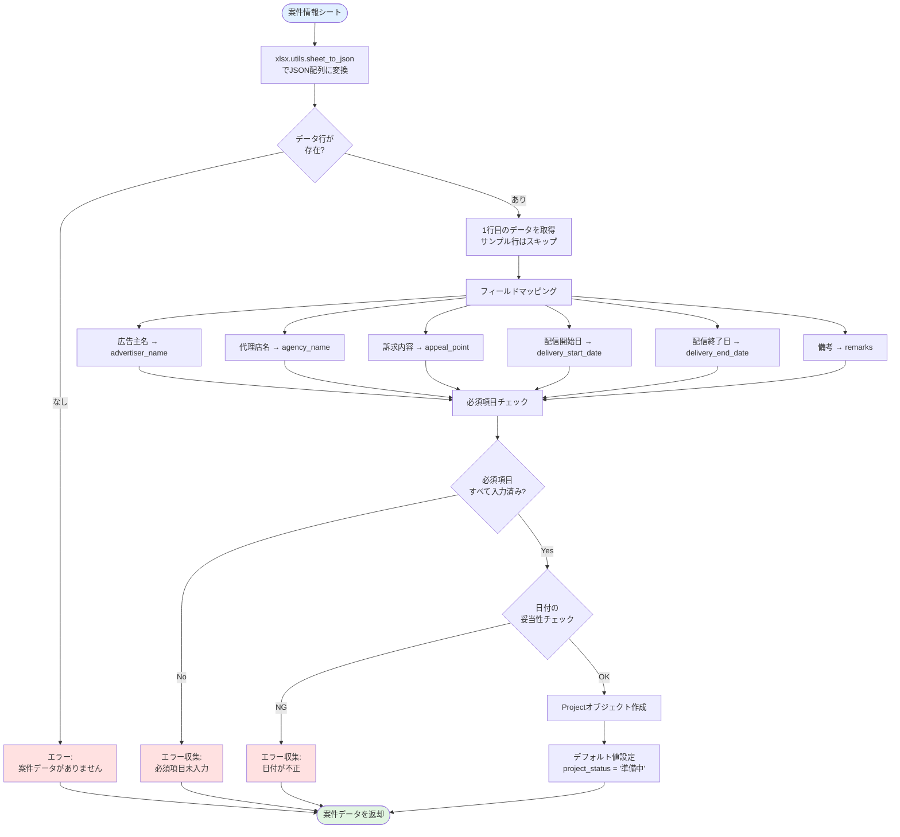
```mermaid
flowchart TD
    Start([案件情報シート]) --> ConvertJSON[xlsx.utils.sheet_to_json<br/>でJSON配列に変換]
    
    ConvertJSON --> CheckRows{データ行が<br/>存在?}
    
    CheckRows -->|なし| ErrorNoData[エラー:<br/>案件データがありません]
    
    CheckRows -->|あり| GetFirstRow[1行目のデータを取得<br/>サンプル行はスキップ]
    
    GetFirstRow --> MapFields[フィールドマッピング]
    
    MapFields --> F1[広告主名 → advertiser_name]
    MapFields --> F2[代理店名 → agency_name]
    MapFields --> F3[訴求内容 → appeal_point]
    MapFields --> F4[配信開始日 → delivery_start_date]
    MapFields --> F5[配信終了日 → delivery_end_date]
    MapFields --> F6[備考 → remarks]
    
    F1 --> ValidateFields[必須項目チェック]
    F2 --> ValidateFields
    F3 --> ValidateFields
    F4 --> ValidateFields
    F5 --> ValidateFields
    F6 --> ValidateFields
    
    ValidateFields --> CheckRequired{必須項目<br/>すべて入力済み?}
    
    CheckRequired -->|No| ErrorRequired[エラー収集:<br/>必須項目未入力]
    
    CheckRequired -->|Yes| CheckDates{日付の<br/>妥当性チェック}
    
    CheckDates -->|NG| ErrorDates[エラー収集:<br/>日付が不正]
    
    CheckDates -->|OK| CreateObject[Projectオブジェクト作成]
    
    CreateObject --> AddDefaults[デフォルト値設定<br/>project_status = '準備中']
    
    AddDefaults --> Return([案件データを返却])
    
    ErrorNoData --> Return
    ErrorRequired --> Return
    ErrorDates --> Return
    
    style Start fill:#e1f0ff
    style Return fill:#e1f5e1
    style ErrorNoData fill:#ffe1e1
    style ErrorRequired fill:#ffe1e1
    style ErrorDates fill:#ffe1e1
```

#### セグメント設定シートのパース

```mermaid
flowchart TD
    Start([セグメント設定シート]) --> ConvertJSON[JSON配列に変換]
    
    ConvertJSON --> InitArray[空の配列を初期化]
    
    InitArray --> LoopStart{各行を<br/>ループ処理}
    
    LoopStart -->|行ごと| CheckSample{サンプル行or<br/>空行?}
    
    CheckSample -->|Yes| LoopStart
    
    CheckSample -->|No| MapRow[行データをマッピング]
    
    MapRow --> M1[セグメント名 → segment_name]
    MapRow --> M2[配信先 → media_id<br/>文字列変換]
    MapRow --> M3[配信範囲 → designated_radius]
    MapRow --> M4[配信期間 → extraction_period]
    MapRow --> M5[対象者 → attribute<br/>文字列変換]
    MapRow --> M6[検知回数 → detection_count<br/>数値変換]
    MapRow --> M7[検知時間 → detection_time_start/end]
    MapRow --> M8[滞在時間 → stay_time<br/>文字列変換]
    MapRow --> M9[AdsアカウントID → ads_account_id]
    
    M1 --> ValidateRow[行バリデーション]
    M2 --> ValidateRow
    M3 --> ValidateRow
    M4 --> ValidateRow
    M5 --> ValidateRow
    M6 --> ValidateRow
    M7 --> ValidateRow
    M8 --> ValidateRow
    M9 --> ValidateRow
    
    ValidateRow --> CheckRowValid{バリデーション<br/>OK?}
    
    CheckRowValid -->|NG| ErrorRow[エラー収集:<br/>行番号とフィールドを記録]
    
    CheckRowValid -->|OK| AddToArray[配列に追加]
    
    ErrorRow --> LoopStart
    AddToArray --> LoopStart
    
    LoopStart -->|全行完了| CheckTVerCTV[TVer(CTV)排他制御チェック]
    
    CheckTVerCTV --> CountCTV{TVer(CTV)が<br/>2つ以上?}
    
    CountCTV -->|Yes| ErrorCTV[エラー収集:<br/>TVer(CTV)排他制御違反]
    
    CountCTV -->|No| CheckDuplicateName[セグメント名重複チェック]
    
    CheckDuplicateName --> HasDuplicate{重複あり?}
    
    HasDuplicate -->|Yes| ErrorDup[エラー収集:<br/>セグメント名重複]
    
    HasDuplicate -->|No| Return([セグメント配列を返却])
    
    ErrorCTV --> Return
    ErrorDup --> Return
    
    style Start fill:#e1f0ff
    style Return fill:#e1f5e1
    style ErrorRow fill:#ffe1e1
    style ErrorCTV fill:#ffe1e1
    style ErrorDup fill:#ffe1e1
```

#### 地点リストシートのパース

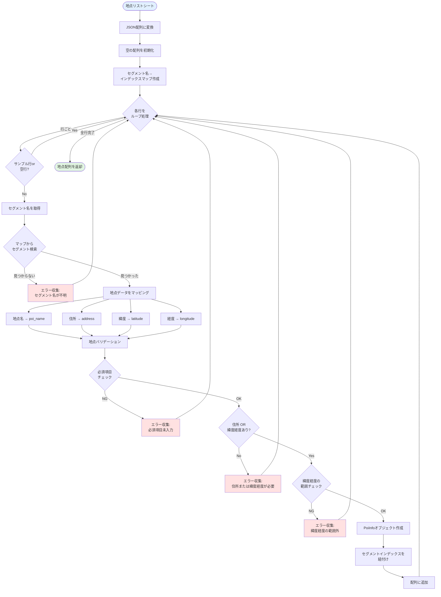
```mermaid
flowchart TD
    Start([地点リストシート]) --> ConvertJSON[JSON配列に変換]
    
    ConvertJSON --> InitArray[空の配列を初期化]
    
    InitArray --> CreateSegmentMap[セグメント名→<br/>インデックスマップ作成]
    
    CreateSegmentMap --> LoopStart{各行を<br/>ループ処理}
    
    LoopStart -->|行ごと| CheckSample{サンプル行or<br/>空行?}
    
    CheckSample -->|Yes| LoopStart
    
    CheckSample -->|No| GetSegmentName[セグメント名を取得]
    
    GetSegmentName --> FindSegment{マップから<br/>セグメント検索}
    
    FindSegment -->|見つからない| ErrorNoSegment[エラー収集:<br/>セグメント名が不明]
    
    FindSegment -->|見つかった| MapLocation[地点データをマッピング]
    
    MapLocation --> L1[地点名 → poi_name]
    MapLocation --> L2[住所 → address]
    MapLocation --> L3[緯度 → latitude]
    MapLocation --> L4[経度 → longitude]
    
    L1 --> ValidateLocation[地点バリデーション]
    L2 --> ValidateLocation
    L3 --> ValidateLocation
    L4 --> ValidateLocation
    
    ValidateLocation --> CheckRequired{必須項目<br/>チェック}
    
    CheckRequired -->|NG| ErrorRequired[エラー収集:<br/>必須項目未入力]
    
    CheckRequired -->|OK| CheckAddressOrLatLng{住所 OR<br/>緯度経度あり?}
    
    CheckAddressOrLatLng -->|No| ErrorNoLocation[エラー収集:<br/>住所または緯度経度が必要]
    
    CheckAddressOrLatLng -->|Yes| CheckLatLng{緯度経度の<br/>範囲チェック}
    
    CheckLatLng -->|NG| ErrorRange[エラー収集:<br/>緯度経度の範囲外]
    
    CheckLatLng -->|OK| CreateLocation[PoiInfoオブジェクト作成]
    
    CreateLocation --> AttachSegmentIndex[セグメントインデックスを<br/>紐付け]
    
    AttachSegmentIndex --> AddToArray[配列に追加]
    
    ErrorNoSegment --> LoopStart
    ErrorRequired --> LoopStart
    ErrorNoLocation --> LoopStart
    ErrorRange --> LoopStart
    AddToArray --> LoopStart
    
    LoopStart -->|全行完了| Return([地点配列を返却])
    
    style Start fill:#e1f0ff
    style Return fill:#e1f5e1
    style ErrorNoSegment fill:#ffe1e1
    style ErrorRequired fill:#ffe1e1
    style ErrorNoLocation fill:#ffe1e1
    style ErrorRange fill:#ffe1e1
```

---

## シーケンス図

### 完全なアップロード〜登録シーケンス

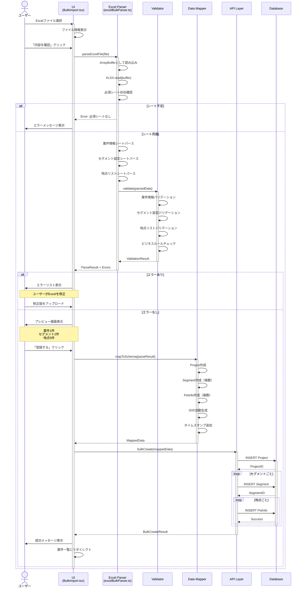
```mermaid
sequenceDiagram
    actor User as ユーザー
    participant UI as UI<br/>(BulkImport.tsx)
    participant Parser as Excel Parser<br/>(excelBulkParser.ts)
    participant Validator as Validator
    participant Mapper as Data Mapper
    participant API as API Layer
    participant DB as Database

    User->>UI: Excelファイル選択
    activate UI
    UI->>UI: ファイル情報表示
    
    User->>UI: 「内容を確認」クリック
    UI->>Parser: parseExcelFile(file)
    activate Parser
    
    Parser->>Parser: ArrayBufferとして読み込み
    Parser->>Parser: XLSX.read(buffer)
    
    Parser->>Parser: 必須シート存在確認
    
    alt シート不足
        Parser-->>UI: Error: 必須シートなし
        UI->>User: エラーメッセージ表示
    else シート完備
        Parser->>Parser: 案件情報シートパース
        Parser->>Parser: セグメント設定シートパース
        Parser->>Parser: 地点リストシートパース
        
        Parser->>Validator: validate(parsedData)
        activate Validator
        
        Validator->>Validator: 案件情報バリデーション
        Validator->>Validator: セグメント設定バリデーション
        Validator->>Validator: 地点リストバリデーション
        Validator->>Validator: ビジネスルールチェック
        
        Validator-->>Parser: ValidationResult
        deactivate Validator
        
        Parser-->>UI: ParseResult + Errors
        deactivate Parser
        
        alt エラーあり
            UI->>User: エラーリスト表示
            Note over User,UI: ユーザーがExcelを修正
            User->>UI: 修正版をアップロード
        else エラーなし
            UI->>User: プレビュー画面表示
            Note over User,UI: 案件1件<br/>セグメント2件<br/>地点5件
            
            User->>UI: 「登録する」クリック
            
            UI->>Mapper: mapToSchema(parseResult)
            activate Mapper
            
            Mapper->>Mapper: Project作成
            Mapper->>Mapper: Segment作成（複数）
            Mapper->>Mapper: PoiInfo作成（複数）
            Mapper->>Mapper: IDの自動生成
            Mapper->>Mapper: タイムスタンプ追加
            
            Mapper-->>UI: MappedData
            deactivate Mapper
            
            UI->>API: bulkCreate(mappedData)
            activate API
            
            API->>DB: INSERT Project
            activate DB
            DB-->>API: ProjectID
            
            loop セグメントごと
                API->>DB: INSERT Segment
                DB-->>API: SegmentID
                
                loop 地点ごと
                    API->>DB: INSERT PoiInfo
                    DB-->>API: Success
                end
            end
            
            deactivate DB
            
            API-->>UI: BulkCreateResult
            deactivate API
            
            UI->>User: 成功メッセージ表示
            UI->>UI: 案件一覧にリダイレクト
        end
    end
    
    deactivate UI
```

### エラーハンドリングシーケンス

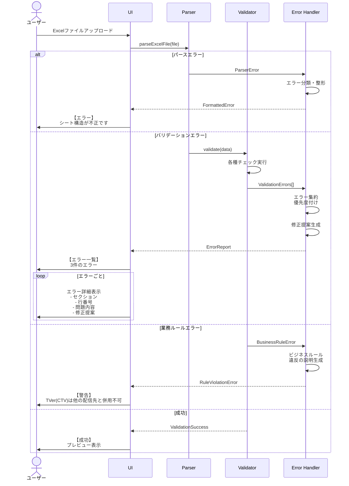
```mermaid
sequenceDiagram
    actor User as ユーザー
    participant UI as UI
    participant Parser as Parser
    participant Validator as Validator
    participant ErrorHandler as Error Handler

    User->>UI: Excelファイルアップロード
    UI->>Parser: parseExcelFile(file)
    
    alt パースエラー
        Parser->>ErrorHandler: ParserError
        ErrorHandler->>ErrorHandler: エラー分類・整形
        ErrorHandler-->>UI: FormattedError
        UI->>User: 【エラー】<br/>シート構造が不正です
        
    else バリデーションエラー
        Parser->>Validator: validate(data)
        Validator->>Validator: 各種チェック実行
        
        Validator->>ErrorHandler: ValidationErrors[]
        ErrorHandler->>ErrorHandler: エラー集約<br/>優先度付け
        ErrorHandler->>ErrorHandler: 修正提案生成
        ErrorHandler-->>UI: ErrorReport
        
        UI->>User: 【エラー一覧】<br/>3件のエラー
        
        loop エラーごと
            UI->>User: エラー詳細表示<br/>- セクション<br/>- 行番号<br/>- 問題内容<br/>- 修正提案
        end
        
    else 業務ルールエラー
        Validator->>ErrorHandler: BusinessRuleError
        ErrorHandler->>ErrorHandler: ビジネスルール<br/>違反の説明生成
        ErrorHandler-->>UI: RuleViolationError
        
        UI->>User: 【警告】<br/>TVer(CTV)は他の配信先と併用不可
        
    else 成功
        Validator-->>UI: ValidationSuccess
        UI->>User: 【成功】<br/>プレビュー表示
    end
```

---

## 状態遷移図

### 一括登録機能の状態遷移

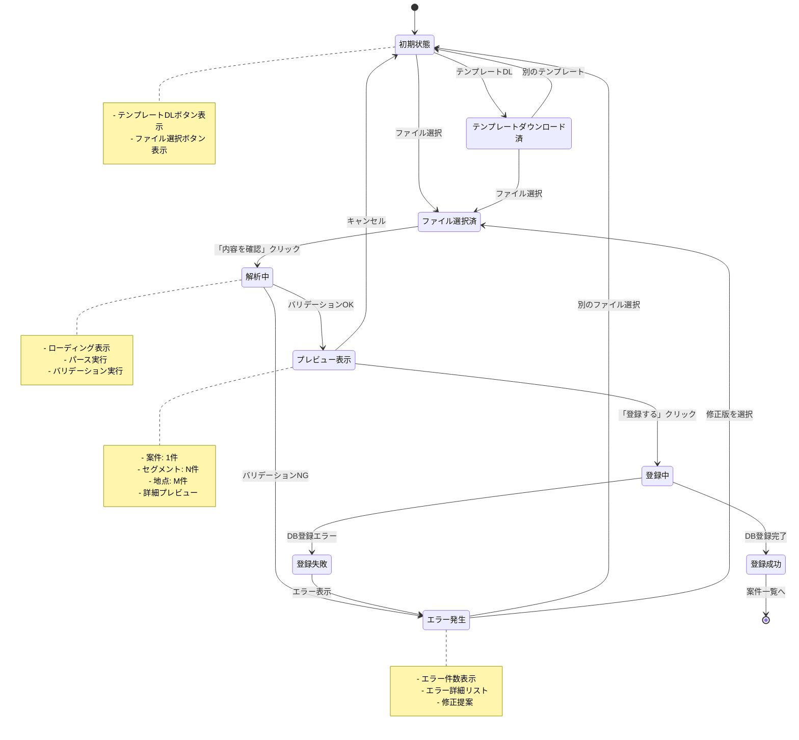
```mermaid
stateDiagram-v2
    [*] --> 初期状態
    
    初期状態 --> テンプレートダウンロード済: テンプレートDL
    テンプレートダウンロード済 --> 初期状態: 別のテンプレート
    
    初期状態 --> ファイル選択済: ファイル選択
    テンプレートダウンロード済 --> ファイル選択済: ファイル選択
    
    ファイル選択済 --> 解析中: 「内容を確認」クリック
    
    解析中 --> エラー発生: バリデーションNG
    解析中 --> プレビュー表示: バリデーションOK
    
    エラー発生 --> 初期状態: 別のファイル選択
    エラー発生 --> ファイル選択済: 修正版を選択
    
    プレビュー表示 --> 登録中: 「登録する」クリック
    プレビュー表示 --> 初期状態: キャンセル
    
    登録中 --> 登録成功: DB登録完了
    登録中 --> 登録失敗: DB登録エラー
    
    登録成功 --> [*]: 案件一覧へ
    登録失敗 --> エラー発生: エラー表示
    
    note right of 初期状態
        - テンプレートDLボタン表示
        - ファイル選択ボタン表示
    end note
    
    note right of 解析中
        - ローディング表示
        - パース実行
        - バリデーション実行
    end note
    
    note right of プレビュー表示
        - 案件: 1件
        - セグメント: N件
        - 地点: M件
        - 詳細プレビュー
    end note
    
    note right of エラー発生
        - エラー件数表示
        - エラー詳細リスト
        - 修正提案
    end note
```

### ファイル処理の状態遷移

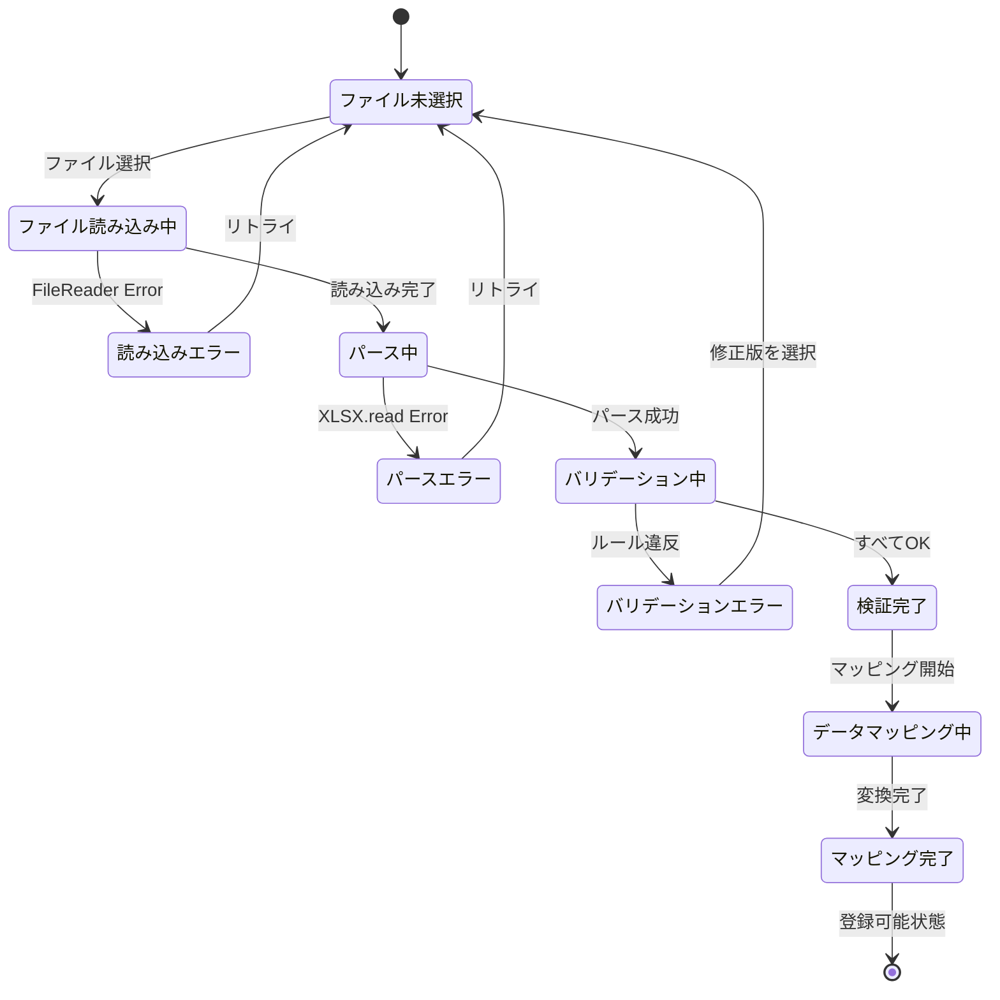
```mermaid
stateDiagram-v2
    [*] --> ファイル未選択
    
    ファイル未選択 --> ファイル読み込み中: ファイル選択
    
    ファイル読み込み中 --> 読み込みエラー: FileReader Error
    ファイル読み込み中 --> パース中: 読み込み完了
    
    読み込みエラー --> ファイル未選択: リトライ
    
    パース中 --> パースエラー: XLSX.read Error
    パース中 --> バリデーション中: パース成功
    
    パースエラー --> ファイル未選択: リトライ
    
    バリデーション中 --> バリデーションエラー: ルール違反
    バリデーション中 --> 検証完了: すべてOK
    
    バリデーションエラー --> ファイル未選択: 修正版を選択
    
    検証完了 --> データマッピング中: マッピング開始
    
    データマッピング中 --> マッピング完了: 変換完了
    
    マッピング完了 --> [*]: 登録可能状態
```

---

## エラーハンドリングフロー

### エラー検出〜回復フロー

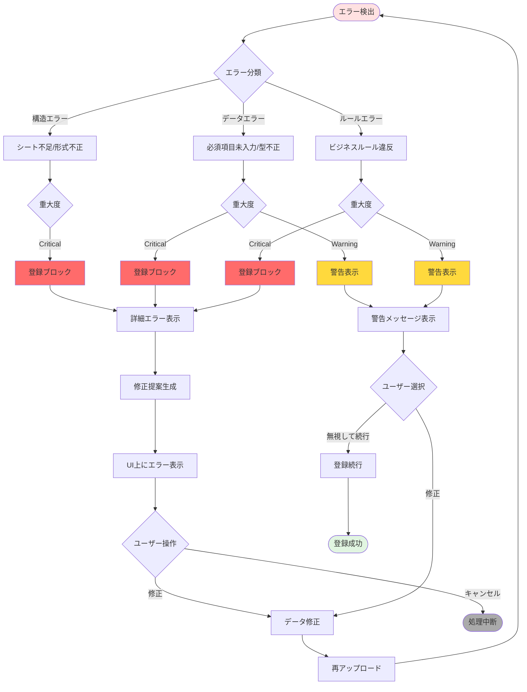
```mermaid
flowchart TD
    Start([エラー検出]) --> Classify{エラー分類}
    
    Classify -->|構造エラー| StructError[シート不足/形式不正]
    Classify -->|データエラー| DataError[必須項目未入力/型不正]
    Classify -->|ルールエラー| RuleError[ビジネスルール違反]
    
    StructError --> StructSeverity{重大度}
    StructSeverity -->|Critical| Block1[登録ブロック]
    
    DataError --> DataSeverity{重大度}
    DataSeverity -->|Critical| Block2[登録ブロック]
    DataSeverity -->|Warning| Warn1[警告表示]
    
    RuleError --> RuleSeverity{重大度}
    RuleSeverity -->|Critical| Block3[登録ブロック]
    RuleSeverity -->|Warning| Warn2[警告表示]
    
    Block1 --> ShowError[詳細エラー表示]
    Block2 --> ShowError
    Block3 --> ShowError
    
    ShowError --> GenerateSuggestion[修正提案生成]
    
    GenerateSuggestion --> DisplayError[UI上にエラー表示]
    
    DisplayError --> UserAction{ユーザー操作}
    
    UserAction -->|修正| FixData[データ修正]
    UserAction -->|キャンセル| Cancel([処理中断])
    
    FixData --> Reupload[再アップロード]
    Reupload --> Start
    
    Warn1 --> ShowWarning[警告メッセージ表示]
    Warn2 --> ShowWarning
    
    ShowWarning --> UserChoice{ユーザー選択}
    
    UserChoice -->|無視して続行| Proceed[登録続行]
    UserChoice -->|修正| FixData
    
    Proceed --> Success([登録成功])
    
    style Start fill:#ffe1e1
    style Cancel fill:#aaa
    style Success fill:#e1f5e1
    style Block1 fill:#ff6b6b
    style Block2 fill:#ff6b6b
    style Block3 fill:#ff6b6b
    style Warn1 fill:#ffd93d
    style Warn2 fill:#ffd93d
```

### エラーメッセージ生成フロー

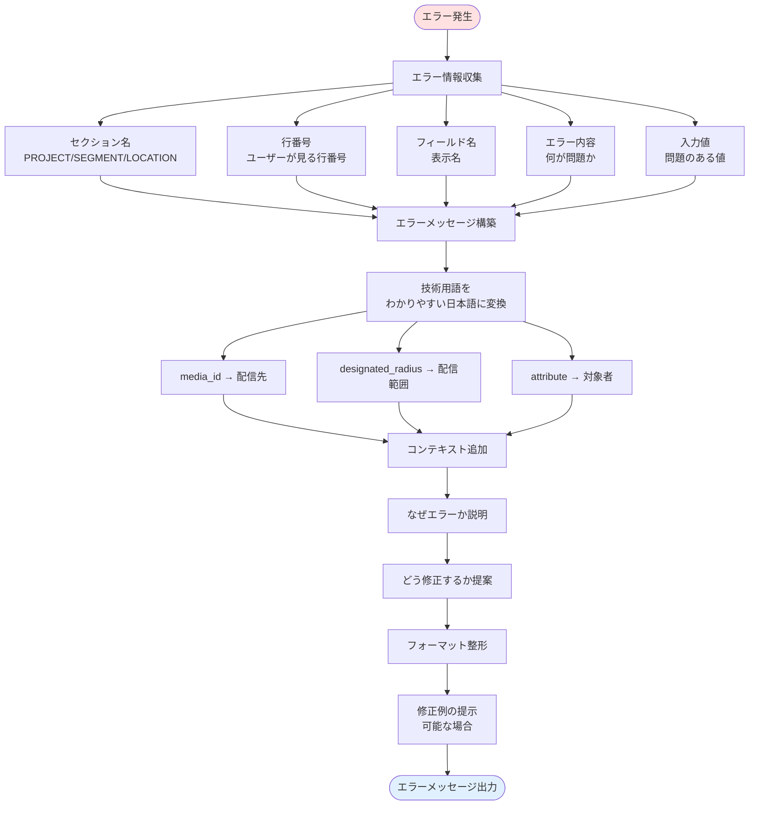
```mermaid
flowchart TD
    Start([エラー発生]) --> Collect[エラー情報収集]
    
    Collect --> Info1[セクション名<br/>PROJECT/SEGMENT/LOCATION]
    Collect --> Info2[行番号<br/>ユーザーが見る行番号]
    Collect --> Info3[フィールド名<br/>表示名]
    Collect --> Info4[エラー内容<br/>何が問題か]
    Collect --> Info5[入力値<br/>問題のある値]
    
    Info1 --> Build[エラーメッセージ構築]
    Info2 --> Build
    Info3 --> Build
    Info4 --> Build
    Info5 --> Build
    
    Build --> Translate[技術用語を<br/>わかりやすい日本語に変換]
    
    Translate --> T1[media_id → 配信先]
    Translate --> T2[designated_radius → 配信範囲]
    Translate --> T3[attribute → 対象者]
    
    T1 --> AddContext[コンテキスト追加]
    T2 --> AddContext
    T3 --> AddContext
    
    AddContext --> WhyError[なぜエラーか説明]
    WhyError --> HowFix[どう修正するか提案]
    
    HowFix --> Format[フォーマット整形]
    
    Format --> Example[修正例の提示<br/>可能な場合]
    
    Example --> Output([エラーメッセージ出力])
    
    style Start fill:#ffe1e1
    style Output fill:#e1f0ff
```

---

## データ変換フロー

### プルダウン値のマッピング

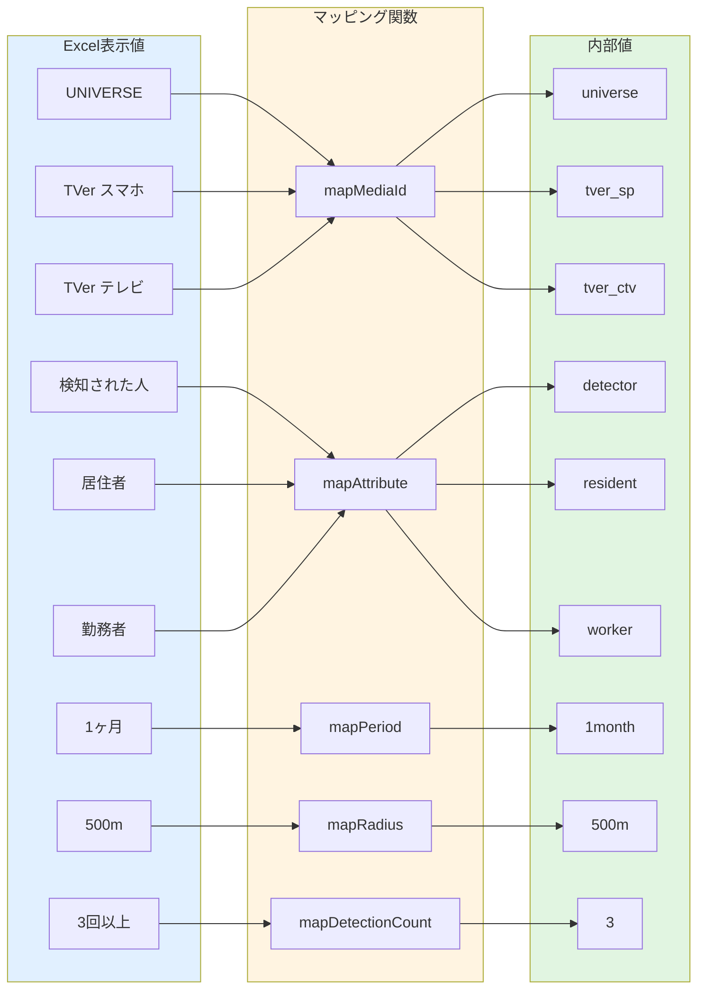
```mermaid
flowchart LR
    subgraph Excel [Excel表示値]
        E1[UNIVERSE]
        E2[TVer スマホ]
        E3[TVer テレビ]
        E4[検知された人]
        E5[居住者]
        E6[勤務者]
        E7[1ヶ月]
        E8[500m]
        E9[3回以上]
    end
    
    subgraph Mapper [マッピング関数]
        M1[mapMediaId]
        M2[mapAttribute]
        M3[mapPeriod]
        M4[mapRadius]
        M5[mapDetectionCount]
    end
    
    subgraph Internal [内部値]
        I1[universe]
        I2[tver_sp]
        I3[tver_ctv]
        I4[detector]
        I5[resident]
        I6[worker]
        I7[1month]
        I8[500m]
        I9[3]
    end
    
    E1 --> M1 --> I1
    E2 --> M1 --> I2
    E3 --> M1 --> I3
    
    E4 --> M2 --> I4
    E5 --> M2 --> I5
    E6 --> M2 --> I6
    
    E7 --> M3 --> I7
    E8 --> M4 --> I8
    E9 --> M5 --> I9
    
    style Excel fill:#e1f0ff
    style Mapper fill:#fff4e1
    style Internal fill:#e1f5e1
```

### オブジェクト構築フロー

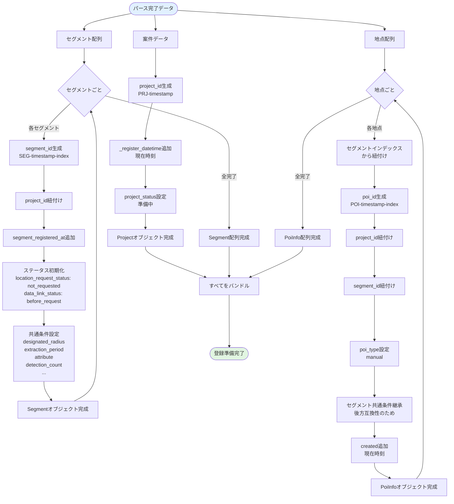
```mermaid
flowchart TD
    Start([パース完了データ]) --> Project[案件データ]
    Start --> Segments[セグメント配列]
    Start --> Locations[地点配列]
    
    Project --> ProjID[project_id生成<br/>PRJ-timestamp]
    ProjID --> ProjTime[_register_datetime追加<br/>現在時刻]
    ProjTime --> ProjStatus[project_status設定<br/>準備中]
    ProjStatus --> ProjObj[Projectオブジェクト完成]
    
    Segments --> SegLoop{セグメントごと}
    
    SegLoop -->|各セグメント| SegID[segment_id生成<br/>SEG-timestamp-index]
    SegID --> SegProjID[project_id紐付け]
    SegProjID --> SegTime[segment_registered_at追加]
    SegTime --> SegStatus[ステータス初期化<br/>location_request_status: not_requested<br/>data_link_status: before_request]
    SegStatus --> SegCommon[共通条件設定<br/>designated_radius<br/>extraction_period<br/>attribute<br/>detection_count<br/>...]
    SegCommon --> SegObj[Segmentオブジェクト完成]
    
    SegObj --> SegLoop
    
    SegLoop -->|全完了| SegArray[Segment配列完成]
    
    Locations --> LocLoop{地点ごと}
    
    LocLoop -->|各地点| LocSegment[セグメントインデックス<br/>から紐付け]
    LocSegment --> LocID[poi_id生成<br/>POI-timestamp-index]
    LocID --> LocProjID[project_id紐付け]
    LocProjID --> LocSegID[segment_id紐付け]
    LocSegID --> LocType[poi_type設定<br/>manual]
    LocType --> LocInherit[セグメント共通条件継承<br/>後方互換性のため]
    LocInherit --> LocTime[created追加<br/>現在時刻]
    LocTime --> LocObj[PoiInfoオブジェクト完成]
    
    LocObj --> LocLoop
    
    LocLoop -->|全完了| LocArray[PoiInfo配列完成]
    
    ProjObj --> Bundle[すべてをバンドル]
    SegArray --> Bundle
    LocArray --> Bundle
    
    Bundle --> Final([登録準備完了])
    
    style Start fill:#e1f0ff
    style Final fill:#e1f5e1
```

### データベース登録フロー

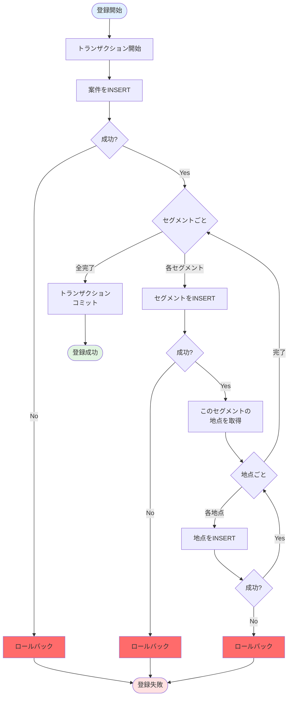
```mermaid
flowchart TD
    Start([登録開始]) --> BeginTx[トランザクション開始]
    
    BeginTx --> InsertProj[案件をINSERT]
    
    InsertProj --> CheckProj{成功?}
    CheckProj -->|No| Rollback1[ロールバック]
    
    CheckProj -->|Yes| LoopSeg{セグメントごと}
    
    LoopSeg -->|各セグメント| InsertSeg[セグメントをINSERT]
    
    InsertSeg --> CheckSeg{成功?}
    CheckSeg -->|No| Rollback2[ロールバック]
    
    CheckSeg -->|Yes| GetLocs[このセグメントの<br/>地点を取得]
    
    GetLocs --> LoopLoc{地点ごと}
    
    LoopLoc -->|各地点| InsertLoc[地点をINSERT]
    
    InsertLoc --> CheckLoc{成功?}
    CheckLoc -->|No| Rollback3[ロールバック]
    
    CheckLoc -->|Yes| LoopLoc
    
    LoopLoc -->|完了| LoopSeg
    
    LoopSeg -->|全完了| Commit[トランザクション<br/>コミット]
    
    Commit --> Success([登録成功])
    
    Rollback1 --> Error([登録失敗])
    Rollback2 --> Error
    Rollback3 --> Error
    
    style Start fill:#e1f0ff
    style Success fill:#e1f5e1
    style Error fill:#ffe1e1
    style Rollback1 fill:#ff6b6b
    style Rollback2 fill:#ff6b6b
    style Rollback3 fill:#ff6b6b
```

---

## パフォーマンス最適化フロー

### 大量データ処理フロー

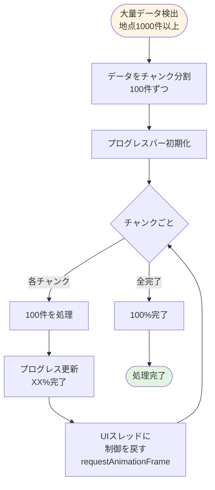
```mermaid
flowchart TD
    Start([大量データ検出<br/>地点1000件以上]) --> Chunk[データをチャンク分割<br/>100件ずつ]
    
    Chunk --> Progress[プログレスバー初期化]
    
    Progress --> LoopChunk{チャンクごと}
    
    LoopChunk -->|各チャンク| ProcessChunk[100件を処理]
    
    ProcessChunk --> UpdateProgress[プログレス更新<br/>XX%完了]
    
    UpdateProgress --> YieldUI[UIスレッドに<br/>制御を戻す<br/>requestAnimationFrame]
    
    YieldUI --> LoopChunk
    
    LoopChunk -->|全完了| Complete[100%完了]
    
    Complete --> End([処理完了])
    
    style Start fill:#fff4e1
    style End fill:#e1f5e1
```

---

## 付録

### エラーコード一覧

| コード | 分類 | 説明 |
|-------|------|------|
| E001 | 構造 | 必須シートが存在しない |
| E002 | 構造 | シート名が不正 |
| E003 | 構造 | ヘッダー行が不正 |
| E101 | 案件 | 広告主名が未入力 |
| E102 | 案件 | 訴求内容が未入力 |
| E103 | 案件 | 配信開始日が不正 |
| E104 | 案件 | 配信終了日が開始日より前 |
| E201 | セグメント | セグメント名が重複 |
| E202 | セグメント | 配信先が未選択 |
| E203 | セグメント | TVer(CTV)が複数存在 |
| E204 | セグメント | 配信範囲が未選択 |
| E301 | 地点 | 地点名が未入力 |
| E302 | 地点 | セグメント名が不明 |
| E303 | 地点 | 住所と緯度経度が両方未入力 |
| E304 | 地点 | 緯度経度の範囲外 |

---

**END OF DOCUMENT**
