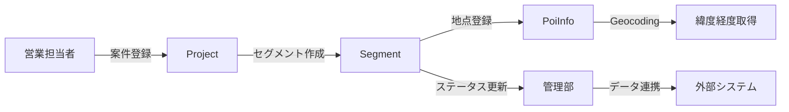
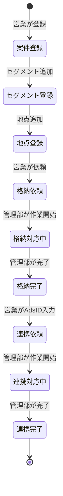

# UNIVERSEGEO ER図（Entity-Relationship Diagram）

**最終更新日:** 2024年12月

---

## 📊 ER図（Mermaid記法）

```mermaid
erDiagram
    User ||--o{ Project : "担当する"
    Project ||--o{ Segment : "含む"
    Segment ||--o{ PoiInfo : "含む"
    
    User {
        string id PK "ユーザーID"
        string name "ユーザー名"
        string email UK "メールアドレス"
        string role "ロール(admin/sales)"
        string department "部署"
        string avatar "アバター画像URL"
    }
    
    Project {
        string project_id PK "案件ID（自動採番）"
        datetime _register_datetime "登録日時（自動採番）"
        string advertiser_name "広告主法人名"
        string agency_name "代理店名"
        string appeal_point "訴求内容"
        string universe_service_id "UNIVERSEサービスID"
        string universe_service_name "UNIVERSEサービス名"
        date delivery_start_date "配信開始日"
        date delivery_end_date "配信終了日"
        string person_in_charge FK "主担当者（User.id）"
        string sub_person_in_charge FK "副担当者（User.id）"
        string remarks "備考"
        string project_status "案件ステータス"
    }
    
    Segment {
        string project_id PK,FK "案件ID"
        string segment_id PK "セグメントID（自動採番）"
        string segment_name "セグメント名"
        datetime segment_registered_at "セグメント登録日時"
        string media_id "配信媒体ID（配列）"
        string location_request_status "地点依頼ステータス"
        boolean request_confirmed "連携依頼フラグ"
        string data_link_status "データ連携ステータス"
        date data_link_scheduled_date "連携予定日"
        date data_link_request_date "データ連携依頼日"
        string ads_account_id "AdsアカウントID"
        string provider_segment_id "プロバイダセグメントID"
        string poi_id "地点グループID"
        date segment_expire_date "セグメント有効期限日"
        string designated_radius "指定半径"
        string extraction_period "抽出期間"
        string extraction_period_type "抽出期間タイプ"
        date extraction_start_date "抽出開始日"
        date extraction_end_date "抽出終了日"
        string attribute "属性"
        int detection_count "検知回数"
        string detection_time_start "検知時間開始"
        string detection_time_end "検知時間終了"
        string stay_time "滞在時間"
    }
    
    PoiInfo {
        string project_id PK,FK "案件ID"
        string segment_id PK,FK "セグメントID"
        string poi_id PK "地点ID"
        string poi_type "地点タイプ"
        string poi_name "地点名"
        string address "住所"
        string prefectures "都道府県リスト（配列）"
        string cities "市区町村リスト（配列）"
        string pkg_category "PKGカテゴリ"
        float latitude "緯度"
        float longitude "経度"
        string designated_radius "指定半径（継承）"
        string extraction_period "抽出期間（継承）"
        string extraction_period_type "抽出期間タイプ（継承）"
        date extraction_start_date "抽出開始日（継承）"
        date extraction_end_date "抽出終了日（継承）"
        string attribute "属性（継承）"
        string detection_time_start "検知時間開始（継承）"
        string detection_time_end "検知時間終了（継承）"
        int detection_count "検知回数（継承）"
        string stay_time "滞在時間（継承）"
        string category_id "半径変換ID"
        string setting_flag "設定フラグ"
        date created "地点登録日"
        string detail_specification_flag "詳細指定フラグ"
    }
```



---

## 📋 エンティティ詳細説明

### User（ユーザー）
**説明**: システム利用者の情報を管理

**主キー**: `id`

**リレーション**:
- 1人のユーザーは、複数の案件を担当できる（主担当者・副担当者）

**ロール**:
- `admin`: 管理者（全権限）
- `sales`: 営業（案件登録・編集権限）

---

### Project（案件）
**説明**: 広告主からの案件情報を管理

**主キー**: `project_id`

**外部キー**:
- `person_in_charge` → `User.id`（主担当者）
- `sub_person_in_charge` → `User.id`（副担当者）

**リレーション**:
- 1つの案件には、複数のセグメントが紐づく（1対多）
- 1つの案件には、1人の主担当者と0〜1人の副担当者が割り当てられる

**ステータス**:
- `draft`: 準備中
- `in_progress`: 進行中
- `pending`: 保留
- `completed`: 完了
- `cancelled`: キャンセル

---

### Segment（セグメント）
**説明**: 配信設定の単位。1案件に複数のセグメントを設定可能

**主キー**: `project_id` + `segment_id`（複合キー）

**外部キー**:
- `project_id` → `Project.project_id`

**リレーション**:
- 1つのセグメントは、1つの案件に属する
- 1つのセグメントには、複数の地点が紐づく（1対多）

**重要フィールド**:
- `media_id`: 配信媒体（UNIVERSE, TVer(SP), TVer(CTV)）
  - 配列形式で複数選択可能
  - ただし、TVer(CTV)は他媒体と併用不可
- セグメント共通条件: このセグメントに属する全地点に適用される条件
  - `designated_radius`: 指定半径
  - `extraction_period`: 抽出期間
  - `attribute`: 属性（検知者/居住者/勤務者）
  - など

**ステータス管理**:
1. **地点依頼ステータス** (`location_request_status`)
   - `not_requested`: 未依頼
   - `storing`: 格納対応中
   - `completed`: 格納完了

2. **データ連携ステータス** (`data_link_status`)
   - `before_request`: 連携依頼前
   - `requested`: 連携依頼済
   - `linked`: 連携済

---

### PoiInfo（地点情報）
**説明**: 配信対象となる地点の詳細情報

**主キー**: `project_id` + `segment_id` + `poi_id`（複合キー）

**外部キー**:
- `project_id` → `Project.project_id`
- `segment_id` → `Segment.segment_id`

**リレーション**:
- 1つの地点は、1つのセグメントに属する

**地点タイプ** (`poi_type`):
1. `manual`: 任意地点指定（住所または緯度経度で指定）
2. `prefecture`: 都道府県・市区町村指定
3. `pkg`: PKG指定（カテゴリ選択）

**共通条件の継承**:
- セグメントで設定された共通条件（半径、期間、属性など）を継承
- 後方互換性のため、地点テーブルにもフィールドを保持

---

## 🔗 リレーションシップの詳細

### User → Project（1対多）
```
User (1) ──担当する──> (N) Project
```
- 1人のユーザーは複数の案件を担当できる
- 1つの案件には必ず1人の主担当者が必要
- 副担当者は任意

### Project → Segment（1対多）
```
Project (1) ──含む──> (N) Segment
```
- 1つの案件には複数のセグメントを設定できる
- 1つのセグメントは1つの案件にのみ属する
- セグメントは最低1つ必要

### Segment → PoiInfo（1対多）
```
Segment (1) ──含む──> (N) PoiInfo
```
- 1つのセグメントには複数の地点を登録できる
- 1つの地点は1つのセグメントにのみ属する
- 地点は最低1つ必要

---

## 📐 カーディナリティ表記

| リレーション | カーディナリティ | 説明 |
|-------------|----------------|------|
| User - Project（主担当） | 1 : N | 1人のユーザーが複数案件の主担当になれる |
| User - Project（副担当） | 1 : N | 1人のユーザーが複数案件の副担当になれる |
| Project - Segment | 1 : N | 1案件に複数セグメント |
| Segment - PoiInfo | 1 : N | 1セグメントに複数地点 |

---

## 🔑 キー制約

### 主キー（Primary Key）

| テーブル | 主キー |
|---------|--------|
| User | id |
| Project | project_id |
| Segment | project_id + segment_id |
| PoiInfo | project_id + segment_id + poi_id |

### 外部キー（Foreign Key）

| テーブル | 外部キー列 | 参照先 |
|---------|-----------|--------|
| Project | person_in_charge | User.id |
| Project | sub_person_in_charge | User.id |
| Segment | project_id | Project.project_id |
| PoiInfo | project_id | Project.project_id |
| PoiInfo | segment_id | Segment.segment_id |

### ユニークキー（Unique Key）

| テーブル | ユニークキー | 説明 |
|---------|-------------|------|
| User | email | メールアドレスは重複不可 |
| Segment | segment_name (within project) | 同一案件内でセグメント名は重複不可 |

---

## 📊 データフロー図



---

## 🎯 ビジネスルールの反映

### 1. TVer(CTV)の排他制御
- 1つの案件（Project）内で、あるセグメントが`media_id`に`tver_ctv`を含む場合、他のセグメントは`tver_ctv`を選択できない
- アプリケーションレベルで制御

### 2. セグメント共通条件
- `Segment`テーブルに共通条件フィールドを保持
- `PoiInfo`テーブルの条件フィールドは、セグメントから継承（後方互換性のため残存）

### 3. 属性と抽出期間の連動
- `attribute`が`resident`または`worker`の場合、`extraction_period`は自動的に`3month`に固定
- アプリケーションレベルで制御

### 4. 編集制限
- `location_request_status`が`storing`以上の場合、地点データ（`PoiInfo`）の編集を制限
- `ads_account_id`と連携依頼は編集可能

---

## 📝 インデックス設計（推奨）

### Project
```sql
-- 案件ID検索
CREATE INDEX idx_project_id ON Project(project_id);

-- 担当者検索
CREATE INDEX idx_person_in_charge ON Project(person_in_charge);

-- ステータス検索
CREATE INDEX idx_project_status ON Project(project_status);

-- 配信期間検索
CREATE INDEX idx_delivery_period ON Project(delivery_start_date, delivery_end_date);
```

### Segment
```sql
-- 案件別セグメント検索
CREATE INDEX idx_segment_project ON Segment(project_id, segment_id);

-- ステータス検索
CREATE INDEX idx_location_status ON Segment(location_request_status);
CREATE INDEX idx_data_link_status ON Segment(data_link_status);
```

### PoiInfo
```sql
-- セグメント別地点検索
CREATE INDEX idx_poi_segment ON PoiInfo(segment_id);

-- 地点タイプ検索
CREATE INDEX idx_poi_type ON PoiInfo(poi_type);

-- 地理情報検索（空間インデックス）
CREATE SPATIAL INDEX idx_poi_location ON PoiInfo(latitude, longitude);
```

---

## 🔄 データライフサイクル



---

**END OF DOCUMENT**
