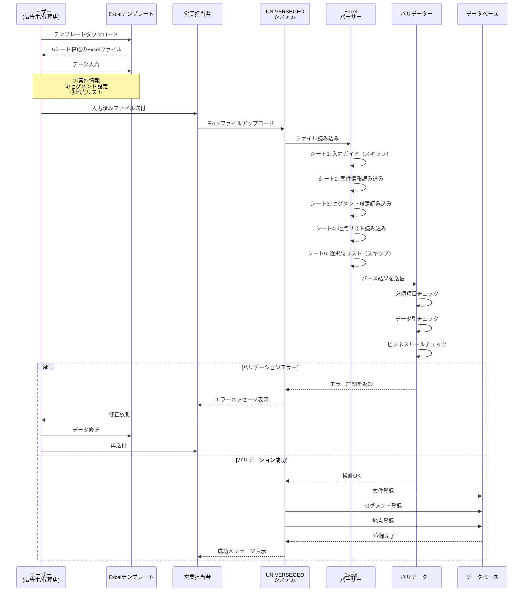
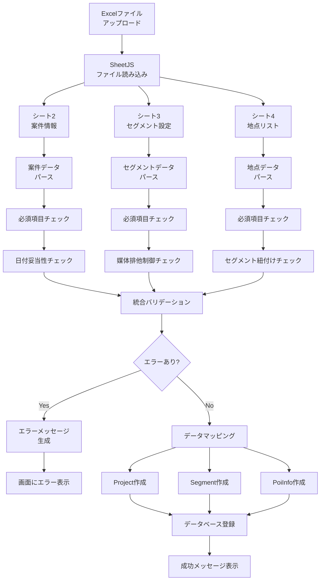
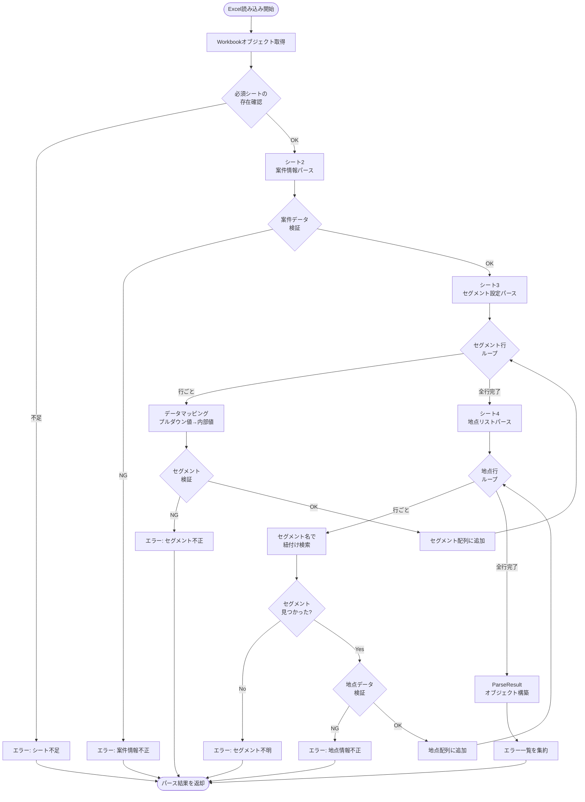
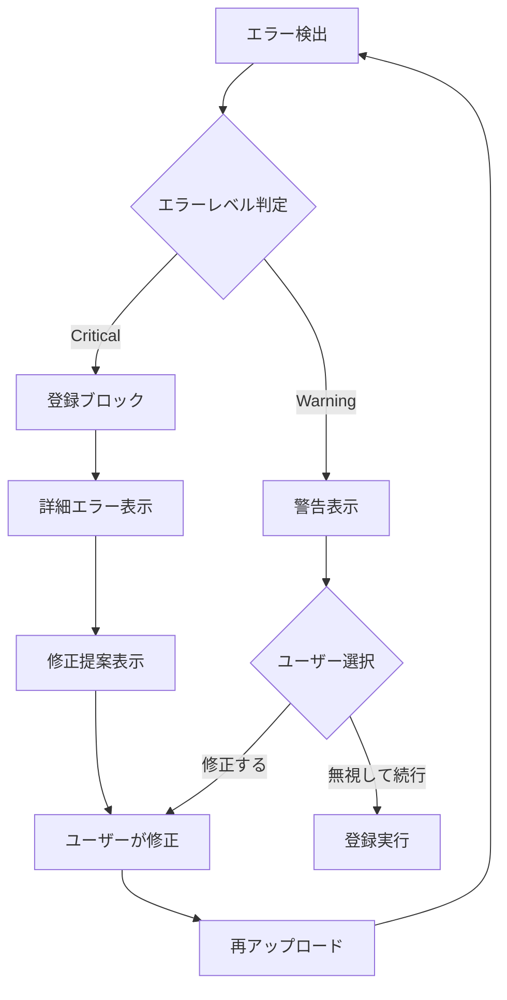

# Excel一括登録機能 仕様書

**バージョン:** 1.0  
**最終更新日:** 2024年12月  
**作成者:** 開発チーム

---

## 📋 目次

1. [機能概要](#機能概要)
2. [目的と背景](#目的と背景)
3. [Excelファイル構成](#excelファイル構成)
4. [シート別詳細仕様](#シート別詳細仕様)
5. [データフロー](#データフロー)
6. [バリデーションルール](#バリデーションルール)
7. [エラーハンドリング](#エラーハンドリング)
8. [UI/UX設計](#uiux設計)
9. [技術仕様](#技術仕様)
10. [CSV形式との比較](#csv形式との比較)
11. [制約事項とビジネスルール](#制約事項とビジネスルール)

---

## 機能概要

### 機能名
**Excel一括登録機能（Excel Bulk Import）**

### 概要
案件情報、セグメント設定、地点リストを1つのExcelファイルで一括登録できる機能。社外の方（広告主や代理店）でも入力可能な、ユーザーフレンドリーな設計。

### 主要な特徴
1. **5シート構成**: 入力ガイド、案件情報、セグメント設定、地点リスト、選択肢リスト
2. **プルダウン入力**: 入力ミスを防ぐドロップダウンリスト
3. **サンプルデータ付き**: 記入例を含むテンプレート（**削除不要！自動スキップ**）
4. **視覚的なUI**: 色分け（赤=必須、グレー=任意）
5. **わかりやすい用語**: 技術用語を排除した日本語表記

---

## 目的と背景

### 解決する課題
1. **入力の複雑性**: 従来のCSV形式では、セクションマーカー（`[PROJECT]`など）や技術用語が必要で、非技術者には難しかった
2. **入力ミス**: 手動入力による配信媒体や期間の誤入力
3. **フォーマット理解の困難**: CSVの構造理解に時間がかかる
4. **社外連携の非効率性**: 営業が代行入力する必要があった

### 目標
1. **社外の方でも入力可能**: 広告主や代理店が直接入力できる
2. **入力時間の短縮**: サンプルとプルダウンで効率化
3. **エラー率の低減**: 入力規則による事前チェック
4. **営業の工数削減**: アップロードするだけで完了

---

## Excelファイル構成

### シート一覧

| シート番号 | シート名 | 表示/非表示 | 行数 | 説明 |
|-----------|---------|-----------|------|------|
| 1 | 入力ガイド | 表示 | 自由 | 使い方の説明 |
| 2 | 案件情報 | 表示 | 2行（ヘッダー+サンプル） | 案件の基本情報 |
| 3 | セグメント設定 | 表示 | 3行（ヘッダー+サンプル2行） | 配信条件の設定 |
| 4 | 地点リスト | 表示 | 6行（ヘッダー+サンプル5行） | 配信地点の一覧 |
| 5 | 選択肢リスト | 非表示 | 可変 | プルダウン用データ |

### ファイル命名規則
```
UNIVERSEGEO_一括登録テンプレート_v{version}.xlsx
例: UNIVERSEGEO_一括登録テンプレート_v1.0.xlsx
```

### ファイルサイズ
- テンプレートサイズ: 約50KB
- 最大ファイルサイズ: 10MB（推奨）

---

## シート別詳細仕様

### 1️⃣ シート1: 入力ガイド

#### 目的
初めて使用する方でも迷わず入力できるよう、手順とルールを説明

#### 構成要素
```
━━━━━━━━━━━━━━━━━━━━━━━━━━━
【UNIVERSEGEO 一括登録の使い方】
━━━━━━━━━━━━━━━━━━━━━━━━━━━

このExcelファイルで案件の一括登録ができます。
以下の順番で入力してください。

━━━━━━━━━━━━━━━━━━━━━━━━━━━
📝 入力手順
━━━━━━━━━━━━━━━━━━━━━━━━━━━

STEP 1: 「②案件情報」シートを開く
　└─ 黄色のセルに必須項目を入力

STEP 2: 「③セグメント設定」シートを開く
　└─ 配信条件を設定（複数行OK）
　└─ 青いセルはプルダウンから選択

STEP 3: 「④地点リスト」シートを開く
　└─ 配信する地点を入力
　└─ セグメント名は③で設定した名前を選択

STEP 4: ファイルを保存
　└─ 営業担当者に送付またはシステムにアップロード

━━━━━━━━━━━━━━━━━━━━━━━━━━━
⚠️ 注意事項
━━━━━━━━━━━━━━━━━━━━━━━━━━━

・黄色のセル = 必須項目（必ず入力）
・青いセル = プルダウンから選択
・サンプル行は削除して入力してください
・⑤選択肢リストシートは編集しないでください

━━━━━━━━━━━━━━━━━━━━━━━━━━━
💡 よくある質問
━━━━━━━━━━━━━━━━━━━━━━━━━━━

Q: 緯度・経度は必須ですか？
A: いいえ。住所を入力すれば自動で取得します。

Q: セグメントはいくつまで登録できますか？
A: 制限はありません。必要な分だけ行を追加してください。

Q: 地点は何件まで登録できますか？
A: 制限はありませんが、1000件を超える場合は複数ファイルに分けることを推奨します。

Q: エラーが出た場合は？
A: アップロード時に詳細なエラーメッセージが表示されます。該当箇所を修正して再度アップロードしてください。

Q: 配信先で「TVer(テレビ)」を選んだら他が選べなくなりました
A: TVer(テレビ)は他の配信先と併用できません。これは仕様です。
```

#### スタイル
- フォント: メイリオ、11pt
- 背景色: 白
- 強調色: 青（`#5b5fff`）

---

### 2️⃣ シート2: 案件情報

#### 目的
1案件の基本情報を入力

#### 構成

##### ヘッダー行（1行目）
| 列 | 項目名 | 説明補足 |
|----|--------|----------|
| A | 広告主名<br>⭐必須 | |
| B | 代理店名 | |
| C | 訴求内容<br>⭐必須 | |
| D | 配信開始日<br>⭐必須 | (例: 2024-04-01) |
| E | 配信終了日<br>⭐必須 | (例: 2024-06-30) |
| F | 備考 | |

##### サンプル行（2行目）
| 列 | サンプル値 |
|----|-----------|
| A | 株式会社サンプル |
| B | 株式会社広告代理店 |
| C | 春の新商品キャンペーン |
| D | 2024-04-01 |
| E | 2024-06-30 |
| F | サンプルです。この行を削除して入力してください |

##### 入力行（3行目）
| 列 | 入力欄 |
|----|--------|
| A | (ここに入力) |
| B | |
| C | |
| D | |
| E | |
| F | |

#### フィールド定義

| フィールド名 | データ型 | 必須 | 最大文字数 | 入力規則 | マッピング先 |
|------------|---------|------|-----------|---------|-------------|
| 広告主名 | テキスト | ⭐ | 100 | なし | `advertiser_name` |
| 代理店名 | テキスト | 任意 | 100 | なし | `agency_name` |
| 訴求内容 | テキスト | ⭐ | 200 | なし | `appeal_point` |
| 配信開始日 | 日付 | ⭐ | - | YYYY-MM-DD形式 | `delivery_start_date` |
| 配信終了日 | 日付 | ⭐ | - | YYYY-MM-DD形式、開始日以降 | `delivery_end_date` |
| 備考 | テキスト | 任意 | 500 | なし | `remarks` |

#### スタイリング
- ヘッダー行: 濃い青背景（`#1e40af`）、白文字、太字
- 必須列: 黄色背景（`#fef3c7`）
- サンプル行: 薄いグレー背景（`#f3f4f6`）、斜体
- 入力行: 白背景

#### セル保護
- ヘッダー行: 保護（編集不可）
- サンプル行: 削除可能
- 入力行: 編集可能

---

### 3️⃣ シート3: セグメント設定

#### 目的
配信条件を設定（複数セグメント可）

#### 構成

##### ヘッダー行（1行目）
| 列 | 項目名 | 説明補足 |
|----|--------|----------|
| A | セグメント名<br>⭐必須 | |
| B | 配信先<br>⭐必須 | |
| C | 配信範囲<br>⭐必須 | |
| D | 配信期間<br>⭐必須 | |
| E | 対象者<br>⭐必須 | |
| F | 検知回数<br>⭐必須 | |
| G | 検知時間<br>開始 | |
| H | 検知時間<br>終了 | |
| I | 滞在時間 | |
| J | Adsアカウント<br>ID | |

##### サンプル行1（2行目）
| 列 | サンプル値 |
|----|-----------|
| A | 東京エリア |
| B | UNIVERSE |
| C | 500m |
| D | 1ヶ月 |
| E | 検知された人 |
| F | 3回以上 |
| G | 09:00 |
| H | 18:00 |
| I | 30分 |
| J | 17890 |

##### サンプル行2（3行目）
| 列 | サンプル値 |
|----|-----------|
| A | 大阪エリア |
| B | TVer(スマホ) |
| C | 300m |
| D | 1ヶ月 |
| E | 検知された人 |
| F | 2回以上 |
| G | |
| H | |
| I | 15分 |
| J | |

##### 入力行（4行目以降）
ユーザーが自由に行を追加できる

#### フィールド定義

| フィールド名 | データ型 | 必須 | プルダウン | マッピング先 |
|------------|---------|------|-----------|-------------|
| セグメント名 | テキスト | ⭐ | なし | `segment_name` |
| 配信先 | 選択 | ⭐ | UNIVERSE / TVer(スマホ) / TVer(テレビ) | `media_id` |
| 配信範囲 | 選択 | ⭐ | 50m / 100m / 300m / 500m / 1000m / 3000m / 5000m / 10000m | `designated_radius` |
| 配信期間 | 選択 | ⭐ | 1ヶ月 / 2ヶ月 / 3ヶ月 / 期間指定 | `extraction_period` |
| 対象者 | 選択 | ⭐ | 検知された人 / 居住者 / 勤務者 | `attribute` |
| 検知回数 | 選択 | ⭐ | 1回以上 / 2回以上 / 3回以上 / 4回以上 / 5回以上 | `detection_count` |
| 検知時間開始 | 時刻 | 任意 | なし | `detection_time_start` |
| 検知時間終了 | 時刻 | 任意 | なし | `detection_time_end` |
| 滞在時間 | 選択 | 任意 | 3分以上 / 5分以上 / 10分以上 / 15分以上 / 30分以上 | `stay_time` |
| AdsアカウントID | テキスト | 任意 | なし | `ads_account_id` |

#### プルダウンデータソース
すべてのプルダウンは「⑤選択肢リスト」シートのデータを参照

#### マッピングロジック

##### 配信先のマッピング
```typescript
const mediaMapping = {
  'UNIVERSE': 'universe',
  'TVer(スマホ)': 'tver_sp',
  'TVer(テレビ)': 'tver_ctv'
};
```

##### 対象者のマッピング
```typescript
const attributeMapping = {
  '検知された人': 'detector',
  '居住者': 'resident',
  '勤務者': 'worker'
};
```

##### 配信期間のマッピング
```typescript
const periodMapping = {
  '1ヶ月': '1month',
  '2ヶ月': '2month',
  '3ヶ月': '3month',
  '期間指定': 'custom' // 別途日付入力が必要
};
```

##### 検知回数のマッピング
```typescript
const detectionMapping = {
  '1回以上': 1,
  '2回以上': 2,
  '3回以上': 3,
  '4回以上': 4,
  '5回以上': 5
};
```

##### 滞在時間のマッピング
```typescript
const stayTimeMapping = {
  '3分以上': '3min',
  '5分以上': '5min',
  '10分以上': '10min',
  '15分以上': '15min',
  '30分以上': '30min',
  // 後方互換性のため
  '3分': '3min',
  '5分': '5min',
  '10分': '10min',
  '15分': '15min',
  '30分': '30min'
};
```

#### スタイリング
- ヘッダー行: 濃い青背景、白文字、太字
- 必須列（A-F）: 黄色背景
- プルダウン列（B-F, I）: 薄い青背景（`#dbeafe`）
- サンプル行: 薄いグレー背景、斜体

#### 条件付き書式

##### TVer(CTV)排他制御の視覚的サポート
```
IF セル=「TVer(テレビ)」 THEN
  行全体を薄いオレンジ背景に変更
  警告アイコン表示（コメント）
END IF
```

##### 居住者/勤務者選択時の期間固定
```
IF 対象者=「居住者」OR「勤務者」 THEN
  配信期間セルをグレーアウト
  自動的に「3ヶ月」を設定
END IF
```

---

### 4️⃣ シート4: 地点リスト

#### 目的
配信する地点を入力

#### 構成

##### ヘッダー行（1行目）
| 列 | 項目名 | 説明補足 |
|----|--------|----------|
| A | どのセグメント？<br>⭐必須 | |
| B | 地点の名前<br>⭐必須 | |
| C | 住所<br>⭐必須（または緯度経度） | |
| D | 緯度 | (通常は空欄でOK) |
| E | 経度 | (通常は空欄でOK) |

##### サンプル行（2-6行目）
| 列A | 列B | 列C | 列D | 列E |
|-----|-----|-----|-----|-----|
| 東京エリア | 新宿駅東口 | 東京都新宿区新宿3-38-1 | | |
| 東京エリア | 渋谷スクランブル交差点 | 東京都渋谷区道玄坂2-1 | | |
| 東京エリア | 池袋駅 | 東京都豊島区南池袋1-28-1 | | |
| 大阪エリア | 梅田駅 | 大阪府大阪市北区角田町8-47 | | |
| 大阪エリア | 難波駅 | 大阪府大阪市中央区難波5-1-60 | | |

##### 入力行（7行目以降）
ユーザーが自由に行を追加できる

#### フィールド定義

| フィールド名 | データ型 | 必須 | プルダウン | マッピング先 |
|------------|---------|------|-----------|-------------|
| どのセグメント？ | 選択 | ⭐ | シート3のセグメント名を動的参照 | `segment_name`（紐付け用） |
| 地点の名前 | テキスト | ⭐ | なし | `poi_name` |
| 住所 | テキスト | ⭐* | なし | `address` |
| 緯度 | 数値 | 任意* | なし | `latitude` |
| 経度 | 数値 | 任意* | なし | `longitude` |

*住所または緯度経度のどちらかは必須

#### プルダウン動的参照
```excel
=セグメント設定!$A$4:$A$100
```
シート3のセグメント名（A列4行目以降）を自動的にプルダウンに反映

#### セグメント紐付けロジック
```typescript
// 地点リストの「どのセグメント？」列の値で、
// どのセグメントに属するかを判定
const segmentIndex = segments.findIndex(
  seg => seg.segment_name === location.segmentName
);
```

#### スタイリング
- ヘッダー行: 濃い青背景、白文字、太字
- 必須列（A-C）: 黄色背景
- プルダウン列（A）: 薄い青背景
- 緯度経度列（D-E）: 薄いグレー背景（任意項目を強調）

#### 入力規則

##### 緯度の入力規則
```
データの入力規則: 数値
最小値: -90
最大値: 90
```

##### 経度の入力規則
```
データの入力規則: 数値
最小値: -180
最大値: 180
```

---

### 5️⃣ シート5: 選択肢リスト（非表示）

#### 目的
プルダウンの選択肢データを一元管理

#### 構成

| 列A | 列B | 列C | 列D | 列E | 列F |
|-----|-----|-----|-----|-----|-----|
| **配信先リスト** | **配信範囲リスト** | **配信期間リスト** | **対象者リスト** | **検知回数リスト** | **滞在時間リスト** |
| UNIVERSE | 50m | 1ヶ月 | 検知された人 | 1回以上 | 5分 |
| TVer(スマホ) | 100m | 2ヶ月 | 居住者 | 2回以上 | 10分 |
| TVer(テレビ) | 300m | 3ヶ月 | 勤務者 | 3回以上 | 15分 |
| | 500m | 期間指定 | | 4回以上 | 30分 |
| | 1000m | | | 5回以上 | 45分 |
| | 3000m | | | | 1時間 |
| | 5000m | | | | 2時間 |
| | 10000m | | | | 3時間 |

#### シート保護
- シート全体を保護（閲覧のみ）
- 非表示設定

#### 名前付き範囲
```excel
配信先リスト: =選択肢リスト!$A$2:$A$4
配信範囲リスト: =選択肢リスト!$B$2:$B$9
配信期間リスト: =選択肢リスト!$C$2:$C$4
対象者リスト: =選択肢リスト!$D$2:$D$4
検知回数リスト: =選択肢リスト!$E$2:$E$6
滞在時間リスト: =選択肢リスト!$F$2:$F$9
```

---

## データフロー

### 全体フロー図



### 詳細データフロー



### パーサーフロー



---

## バリデーションルール

### 案件情報バリデーション

| 項目 | ルール | エラーメッセージ例 |
|------|-------|------------------|
| 広告主名 | 必須、1-100文字 | 「案件情報シート: 広告主名は必須です」 |
| 訴求内容 | 必須、1-200文字 | 「案件情報シート: 訴求内容は必須です」 |
| 配信開始日 | 必須、YYYY-MM-DD形式 | 「案件情報シート: 配信開始日は YYYY-MM-DD 形式で入力してください」 |
| 配信終了日 | 必須、YYYY-MM-DD形式、開始日以降 | 「案件情報シート: 配信終了日は配信開始日以降の日付を指定してください」 |

### セグメント設定バリデーション

| 項目 | ルール | エラーメッセージ例 |
|------|-------|------------------|
| セグメント名 | 必須、同一案件内で一意 | 「セグメント設定シート 3行目: セグメント名「東京エリア」は既に使用されています」 |
| 配信先 | 必須、プルダウンから選択 | 「セグメント設定シート 3行目: 配信先はプルダウンから選択してください」 |
| TVer(CTV)排他 | 案件内でTVer(CTV)は1つのみ | 「セグメント設定シート 4行目: TVer(テレビ)は他の配信先と併用できません」 |
| 配信範囲 | 必須、プルダウンから選択 | 「セグメント設定シート 3行目: 配信範囲はプルダウンから選択してください」 |
| 配信期間 | 必須、プルダウンから選択 | 「セグメント設定シート 3行目: 配信期間はプルダウンから選択してください」 |
| 対象者 | 必須、プルダウンから選択 | 「セグメント設定シート 3行目: 対象者はプルダウンから選択してください」 |
| 検知回数 | 必須、プルダウンから選択 | 「セグメント設定シート 3行目: 検知回数はプルダウンから選択してください」 |
| 検知時間 | 両方指定またはなし、終了>開始 | 「セグメント設定シート 3行目: 検知時間は開始と終了を両方指定してください」 |
| 居住者/勤務者の期間 | 居住者・勤務者の場合は3ヶ月固定 | 「セグメント設定シート 3行目: 居住者・勤務者の場合、配信期間は3ヶ月です」 |

### 地点リストバリデーション

| 項目 | ルール | エラーメッセージ例 |
|------|-------|------------------|
| セグメント名 | 必須、セグメント設定に存在 | 「地点リスト 3行目: セグメント「名古屋エリア」が見つかりません」 |
| 地点名 | 必須、1-100文字 | 「地点リスト 3行目: 地点の名前は必須です」 |
| 住所/緯度経度 | どちらか必須 | 「地点リスト 3行目: 住所または緯度経度のどちらかは必須です」 |
| 緯度 | -90〜90の範囲 | 「地点リスト 3行目: 緯度は -90〜90 の範囲で指定してください」 |
| 経度 | -180〜180の範囲 | 「地点リスト 3行目: 経度は -180〜180 の範囲で指定してください」 |

### バリデーション優先順位

```
1. 構造チェック（必須シートの存在）
2. 必須項目チェック
3. データ型チェック
4. 範囲チェック
5. ビジネスルールチェック
6. 参照整合性チェック
```

---

## エラーハンドリング

### エラー分類

#### レベル1: クリティカルエラー（登録不可）
```typescript
{
  level: 'critical',
  section: 'PROJECT',
  row: 2,
  field: '広告主名',
  message: '広告主名は必須です',
  value: ''
}
```

#### レベル2: 警告（登録可能だが確認推奨）
```typescript
{
  level: 'warning',
  section: 'SEGMENT',
  row: 3,
  field: '検知時間',
  message: '検知時間が指定されていません。全時間帯が対象になります',
  value: ''
}
```

### エラー表示UI

```typescript
interface ErrorDisplay {
  // エラーサマリー
  summary: {
    criticalCount: number;
    warningCount: number;
    totalCount: number;
  };
  
  // エラー詳細リスト
  errors: Array<{
    section: string;      // 'PROJECT' | 'SEGMENT' | 'LOCATION'
    row: number;          // 行番号
    field?: string;       // フィールド名
    message: string;      // エラーメッセージ
    value?: string;       // 問題のある値
    suggestion?: string;  // 修正提案
  }>;
}
```

### エラーメッセージ例

#### 良い例 ✅
```
セグメント設定シート 3行目:
配信先「TVer(テレビ)」は他の配信先と併用できません。
2行目で「UNIVERSE」が選択されています。
どちらか一方のみを選択してください。
```

#### 悪い例 ❌
```
Error: Invalid media_id at row 3
```

### エラー回復フロー



---

## UI/UX設計

### アップロード画面

```
┌─────────────────────────────────────────────────┐
│  📊 Excel一括登録                                │
├─────────────────────────────────────────────────┤
│                                                  │
│  ℹ️ Excelファイルで案件を一括登録               │
│                                                  │
│  【ステップ1】テンプレートをダウンロード         │
│  ┌──────────────────────────────────────────┐   │
│  │  📥 Excelテンプレートをダウンロード       │   │
│  └──────────────────────────────────────────┘   │
│                                                  │
│  【ステップ2】Excelファイルをアップロード        │
│  ┌──────────────────────────────────────────┐   │
│  │  ファイルを選択: [sample.xlsx]    [選択] │   │
│  └──────────────────────────────────────────┘   │
│                                                  │
│  ┌──────────────────────────────────────────┐   │
│  │  🔍 内容を確認                            │   │
│  └──────────────────────────────────────────┘   │
│                                                  │
└─────────────────────────────────────────────────┘
```

### プレビュー画面

```
┌─────────────────────────────────────────────────┐
│  ✅ ファイルを確認しました                        │
├─────────────────────────────────────────────────┤
│                                                  │
│  📊 登録内容                                     │
│  ┌────────┬────────┬────────┐                   │
│  │ 案件   │ セグメ │ 地点   │                   │
│  │        │ ント   │        │                   │
│  │ 1件    │ 2件    │ 5件    │                   │
│  └────────┴────────┴────────┘                   │
│                                                  │
│  📋 案件情報                                     │
│  • 広告主: 株式会社サンプル                      │
│  • 訴求内容: 春の新商品キャンペーン              │
│  • 配信期間: 2024-04-01 〜 2024-06-30           │
│                                                  │
│  📊 セグメント情報（2件）                        │
│  ┌──────────────────────────────────────────┐   │
│  │ 東京エリア                       5地点 ✓ │   │
│  │ • UNIVERSE / 500m / 1ヶ月               │   │
│  └──────────────────────────────────────────┘   │
│  ┌──────────────────────────────────────────┐   │
│  │ 大阪エリア                       2地点 ✓ │   │
│  │ • TVer(スマホ) / 300m / 1ヶ月           │   │
│  └──────────────────────────────────────────┘   │
│                                                  │
│  ┌──────────────────────────────────────────┐   │
│  │  ✔️ 登録する                              │   │
│  └──────────────────────────────────────────┘   │
│                                                  │
└─────────────────────────────────────────────────┘
```

### エラー表示画面

```
┌─────────────────────────────────────────────────┐
│  ❌ エラーが見つかりました                        │
├─────────────────────────────────────────────────┤
│                                                  │
│  3件のエラーがあります                           │
│                                                  │
│  ┌──────────────────────────────────────────┐   │
│  │ ⚠️ セグメント設定シート 3行目              │   │
│  │                                           │   │
│  │ 配信先「TVer(テレビ)」は他の配信先と      │   │
│  │ 併用できません。                          │   │
│  │                                           │   │
│  │ 💡 修正方法:                              │   │
│  │ 3行目の配信先を「UNIVERSE」または         │   │
│  │ 「TVer(スマホ)」に変更してください。      │   │
│  └──────────────────────────────────────────┘   │
│                                                  │
│  ┌──────────────────────────────────────────┐   │
│  │ ⚠️ 地点リスト 5行目                       │   │
│  │                                           │   │
│  │ セグメント「名古屋エリア」が見つかりま    │   │
│  │ せん。                                    │   │
│  │                                           │   │
│  │ 💡 修正方法:                              │   │
│  │ セグメント設定シートに「名古屋エリア」を  │   │
│  │ 追加するか、既存のセグメント名を選択して  │   │
│  │ ください。                                │   │
│  └──────────────────────────────────────────┘   │
│                                                  │
│  ┌──────────────────────────────────────────┐   │
│  │  🔙 修正してもう一度アップロード          │   │
│  └──────────────────────────────────────────┘   │
│                                                  │
└─────────────────────────────────────────────────┘
```

### ユーザビリティガイドライン

1. **段階的開示**: 必要な情報を段階的に表示
2. **プログレス表示**: 処理中は進捗を表示
3. **明確なフィードバック**: 成功・エラーを明確に
4. **具体的なエラーメッセージ**: 場所と修正方法を提示
5. **元に戻せる**: 登録前にプレビュー確認

---

## 技術仕様

### 使用ライブラリ

```json
{
  "xlsx": "^0.18.5"
}
```

### インポート方法

```typescript
import * as XLSX from 'xlsx';
```

### Excelテンプレート生成

```typescript
function generateExcelTemplate(): XLSX.WorkBook {
  const wb = XLSX.utils.book_new();
  
  // シート1: 入力ガイド
  const guideSheet = createGuideSheet();
  XLSX.utils.book_append_sheet(wb, guideSheet, '①入力ガイド');
  
  // シート2: 案件情報
  const projectSheet = createProjectSheet();
  XLSX.utils.book_append_sheet(wb, projectSheet, '②案件情報');
  
  // シート3: セグメント設定
  const segmentSheet = createSegmentSheet();
  XLSX.utils.book_append_sheet(wb, segmentSheet, '③セグメント設定');
  
  // シート4: 地点リスト
  const locationSheet = createLocationSheet();
  XLSX.utils.book_append_sheet(wb, locationSheet, '④地点リスト');
  
  // シート5: 選択肢リスト
  const optionsSheet = createOptionsSheet();
  XLSX.utils.book_append_sheet(wb, optionsSheet, '⑤選択肢リスト');
  
  // シート5を非表示に
  wb.Workbook = { Sheets: [
    { Hidden: 0 }, // シート1
    { Hidden: 0 }, // シート2
    { Hidden: 0 }, // シート3
    { Hidden: 0 }, // シート4
    { Hidden: 1 }, // シート5（非表示）
  ]};
  
  return wb;
}
```

### データ検証（プルダウン）の実装

```typescript
function addDropdownValidation(
  ws: XLSX.WorkSheet,
  range: string,
  options: string[]
) {
  if (!ws['!dataValidation']) {
    ws['!dataValidation'] = [];
  }
  
  ws['!dataValidation'].push({
    sqref: range,
    type: 'list',
    formula1: `"${options.join(',')}"`,
    showDropDown: true,
    allowBlank: false
  });
}
```

### スタイリングの実装

```typescript
function applyCellStyle(
  ws: XLSX.WorkSheet,
  cell: string,
  style: CellStyle
) {
  if (!ws[cell]) return;
  
  ws[cell].s = {
    fill: {
      fgColor: { rgb: style.bgColor }
    },
    font: {
      bold: style.bold,
      italic: style.italic,
      color: { rgb: style.fontColor }
    },
    alignment: {
      horizontal: style.align,
      vertical: 'center'
    }
  };
}
```

### Excelファイル読み込み

```typescript
async function parseExcelFile(file: File): Promise<ParsedExcelData> {
  const buffer = await file.arrayBuffer();
  const wb = XLSX.read(buffer, { type: 'array' });
  
  // 必須シートの存在確認
  const requiredSheets = ['②案件情報', '③セグメント設定', '④地点リスト'];
  const missingSheets = requiredSheets.filter(
    name => !wb.SheetNames.includes(name)
  );
  
  if (missingSheets.length > 0) {
    throw new Error(`必須シートがありません: ${missingSheets.join(', ')}`);
  }
  
  // 各シートをパース
  const projectSheet = wb.Sheets['②案件情報'];
  const segmentSheet = wb.Sheets['③セグメント設定'];
  const locationSheet = wb.Sheets['④地点リスト'];
  
  const projectData = parseProjectSheet(projectSheet);
  const segmentData = parseSegmentSheet(segmentSheet);
  const locationData = parseLocationSheet(locationSheet, segmentData);
  
  return {
    project: projectData,
    segments: segmentData,
    locations: locationData
  };
}
```

### シートパーサー例

```typescript
function parseSegmentSheet(ws: XLSX.WorkSheet): SegmentData[] {
  // シートをJSON配列に変換（ヘッダー行を使用）
  const data = XLSX.utils.sheet_to_json<any>(ws, { 
    range: 1 // 2行目（ヘッダー）から開始
  });
  
  const segments: SegmentData[] = [];
  
  for (let i = 0; i < data.length; i++) {
    const row = data[i];
    const rowNum = i + 3; // 実際の行番号（ヘッダー+サンプル行を考慮）
    
    // サンプル行をスキップ
    if (row['セグメント名']?.includes('サンプル')) continue;
    // 空行をスキップ
    if (!row['セグメント名'] || row['セグメント名'] === '(ここに入力)') continue;
    
    // データマッピング
    const segment: SegmentData = {
      segment_name: row['セグメント名'],
      media_id: mapMediaId(row['配信先']),
      designated_radius: mapRadius(row['配信範囲']),
      extraction_period: mapPeriod(row['配信期間']),
      attribute: mapAttribute(row['対象者']),
      detection_count: mapDetectionCount(row['検知回数']),
      detection_time_start: row['検知時間\n開始'] || '',
      detection_time_end: row['検知時間\n終了'] || '',
      stay_time: mapStayTime(row['滞在時間']),
      ads_account_id: row['AdsアカウントID'] || undefined,
      _rowNum: rowNum
    };
    
    segments.push(segment);
  }
  
  return segments;
}
```

### ダウンロード処理

```typescript
function downloadExcelTemplate() {
  const wb = generateExcelTemplate();
  
  // Excelファイルをバイナリ形式で生成
  const wbout = XLSX.write(wb, { 
    bookType: 'xlsx', 
    type: 'array',
    cellStyles: true
  });
  
  // Blobを作成
  const blob = new Blob([wbout], { 
    type: 'application/vnd.openxmlformats-officedocument.spreadsheetml.sheet' 
  });
  
  // ダウンロードリンクを生成
  const link = document.createElement('a');
  const url = URL.createObjectURL(blob);
  
  link.setAttribute('href', url);
  link.setAttribute('download', 'UNIVERSEGEO_一括登録テンプレート_v1.0.xlsx');
  link.style.visibility = 'hidden';
  
  document.body.appendChild(link);
  link.click();
  document.body.removeChild(link);
  
  URL.revokeObjectURL(url);
}
```

---

## CSV形式との比較

### 機能比較表

| 項目 | CSV形式 | Excel形式 |
|------|---------|-----------|
| ファイル形式 | .csv（UTF-8 BOM） | .xlsx |
| 入力方法 | テキストエディタ/Excel | Excel専用 |
| セクション分け | `[PROJECT]`などのマーカー | シート分割 |
| プルダウン入力 | ❌ 不可 | ✅ 可能 |
| サンプルデータ | ❌ なし | ✅ あり |
| 入力ガイド | 外部ドキュメント | ファイル内に含まれる |
| 色分け表示 | ❌ 不可 | ✅ 可能（必須項目など） |
| 動的参照 | ❌ 不可 | ✅ 可能（セグメ���ト名など） |
| エラー事前検知 | アップロード時のみ | 入力規則でチェック |
| 技術的知識 | 必要（マーカー、カンマ区切りなど） | 不要 |
| 社外の方の入力 | ⚠️ 難しい | ✅ 容易 |
| ファイルサイズ | 小（数KB） | 中（数十KB） |
| 互換性 | 高（テキストエディタ可） | 中（Excel必須） |

### 移行計画

```
フェーズ1: Excel形式を追加リリース
  ├─ CSV形式は引き続きサポート
  └─ ユーザーはどちらでも選択可能

フェーズ2: ユーザーフィードバック収集（3ヶ月）
  ├─ Excel形式の利用率を測定
  └─ 改善要望を収集

フェーズ3: Excel形式をメイン推奨
  ├─ UI上でExcel形式を優先表示
  └─ CSV形式は「詳細オプション」に移動

フェーズ4（検討中）: CSV形式の廃止
  ├─ 利用率とユーザー意見を踏まえて判断
  └─ 廃止の場合は6ヶ月前に告知
```

---

## 制約事項とビジネスルール

### Excel固有の制約

1. **ファイル形式**: .xlsx のみサポート（.xls, .csv は不可）
2. **最大行数**: 各シート10,000行まで（Excel仕様: 1,048,576行）
3. **ファイルサイズ**: 10MB まで推奨
4. **Excelバージョン**: Excel 2007以降（Office Open XML形式）

### 入力制約

1. **案件情報**: 1件のみ登録可能（複数案件は別ファイルで）
2. **セグメント数**: 制限なし（推奨: 50件まで）
3. **地点数**: 制限なし（推奨: 1ファイルあたり1,000件まで）
4. **セグメント名**: 同一案件内で一意（重複不可）

### ビジネスルール

#### 1. TVer(CTV)排他制御
```
IF セグメントA.media_id = 'tver_ctv' THEN
  セグメントB.media_id ≠ 'tver_ctv'
  セグメントC.media_id ≠ 'tver_ctv'
  ...
END IF
```

#### 2. 居住者・勤務者の期間固定
```
IF attribute = 'resident' OR attribute = 'worker' THEN
  extraction_period = '3month' (固定)
END IF
```

#### 3. 検知時間の整合性
```
IF detection_time_start IS NOT EMPTY THEN
  detection_time_end IS NOT EMPTY (必須)
  detection_time_start < detection_time_end
END IF
```

#### 4. 日付の妥当性
```
delivery_end_date >= delivery_start_date
extraction_end_date >= extraction_start_date
```

#### 5. セグメント紐付け
```
地点リスト.セグメント名 ∈ セグメント設定.セグメント名
```

---

## 付録

### A. サンプルデータ

#### 案件情報サンプル
| 広告主名 | 代理店名 | 訴求内容 | 配信開始日 | 配信終了日 | 備考 |
|---------|---------|---------|-----------|-----------|------|
| 株式会社サンプル | 株式会社広告代理店 | 春の新商品キャンペーン | 2024-04-01 | 2024-06-30 | サンプルです |

#### セグメント設定サンプル
| セグメント名 | 配信先 | 配信範囲 | 配信期間 | 対象者 | 検知回数 | 検知時間開始 | 検知時間終了 | 滞在時間 |
|------------|--------|---------|---------|--------|---------|------------|------------|---------|
| 東京エリア | UNIVERSE | 500m | 1ヶ月 | 検知された人 | 3回以上 | 09:00 | 18:00 | 30分 |
| 大阪エリア | TVer(スマホ) | 300m | 1ヶ月 | 検知された人 | 2回以上 | | | 15分 |

#### 地点リストサンプル
| どのセグメント？ | 地点の名前 | 住所 | 緯度 | 経度 |
|---------------|----------|------|------|------|
| 東京エリア | 新宿駅東口 | 東京都新宿区新宿3-38-1 | | |
| 東京エリア | 渋谷スクランブル交差点 | 東京都渋谷区道玄坂2-1 | | |
| 大阪エリア | 梅田駅 | 大阪府大阪市北区角田町8-47 | | |

### B. よくある質問（FAQ）

**Q1: Googleスプレッドシートでも使えますか？**
A: いいえ、現在は Microsoft Excel の .xlsx形式のみサポートしています。Googleスプレッドシートで作成した場合は、「ファイル > ダウンロード > Microsoft Excel (.xlsx)」でエクセル形式に変換してからアップロードしてください。

**Q2: プルダウンの選択肢を増やせますか？**
A: プルダウンの選択肢はシステムで管理しているため、ユーザーが追加することはできません。新しい選択肢が必要な場合は、営業担当者にお問い合わせください。

**Q3: 複数の案件を一度に登録できますか？**
A: いいえ、1つのExcelファイルで1案件のみ登録可能です。複数案件を登録する場合は、案件ごとに別のExcelファイルを作成してください。

**Q4: エラーが多すぎて修正が大変です**
A: エラーが多い場合は、まず案件情報とセグメント設定を先に確認してください。これらが正しくないと、地点情報でもエラーが発生します。

**Q5: サンプル行は削除しないといけませんか？**
A: サンプル行は自動的にスキップされるため、削除しなくても問題ありませんが、削除することを推奨します。

**Q6: テンプレートに変更を加えてもいいですか？**
A: ヘッダー行やシート名は変更しないでください。変更するとシステムが正しく読み込めなくなります。行の追加や色の変更は問題ありません。

### C. 参考資料

- [Excel一括登録フロー図](./BULK_IMPORT_FLOW.md)
- [Excelテンプレート定義（CSV）](./EXCEL_TEMPLATE_DEFINITION.csv)
- [システム仕様書](./SYSTEM_SPECIFICATION.md)
- [ER図](./ER_DIAGRAM.md)

---

**END OF DOCUMENT**
